*本 WriteUp 与 [Annms_](https://annm5oi.site/)共同编写*

# 解题列表

| 方向   | 题目名称            | 解题人       |
| ------ | ------------------- | ------------ |
| Web    | the-moment-of-token | asan         |
| Misc   | Forensics1          | asan         |
| Misc   | 隐藏的二维码        | asan，Annms_ |
| Crypto | 哈基米喔            | Annms_       |
| Crypto | 这里有一串神秘代码  | Annms_       |
| Rev    | 迷宫里面有什么      | Annms_       |
| Rev    | 安卓                | Annms_       |
| Rev    | 分成三份的旗        | Annms_       |

# Web

## the-moment-of-token

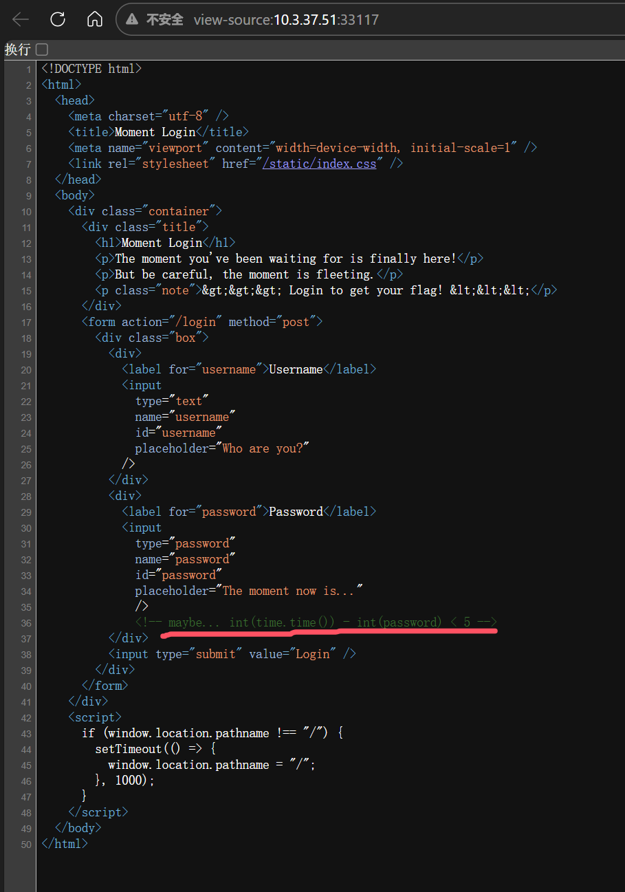

查看源代码发现提示注释，密码正确的条件为 `当前时间戳 - 密码 < 5` ，猜测用户名为 `admin`。

编写脚本：

```python
import time
import requests
payload = int(time.time()) - 4
response = requests.post("http://10.3.37.51:33117/login", data={'username': 'admin', 'password': str(payload)})
print(response.text)
print(response.headers)
```


响应体出现 `Login success!`，响应头出现了 Cookie，带有 JWT Token，对其进行解码。


`gift`字段为 base32 编码信息，解码后获得flag。

### Flag

```
lrtctf{28e68e00-4e3c-4a29-88d5-6311cbb5958c}
```

# Misc

## **Forensics1**

[for.zip](for.zip)

Wireshark打开；


发现 `Host: tsdandassociates.co.sz` 和 `GET /w0ks//?YO=1702920835`

构造flag。

### Flag

```
lrtctf{tsdandassociates.co.sz/w0ks//?YO=1702920835}
```

## 隐藏的二维码

[隐藏的二维码.zip](隐藏的二维码.zip)


分析 `1.jpg`发现包含了一张png图片，使用foremost提取出来，得到第一部分二维码


分析 `4.svg`发现并非svg，而是png，更改扩展名后得到第四部分二维码


`number8.rar`为rar5加密压缩包，使用 [hashcat](https://hashcat.net/hashcat/) 和 [John the Ripper](https://www.openwall.com/john/) 中的 rar2john 工具进行暴力破解，密码为8位数字。


使用 rar2john 得到哈希值： `$rar5$16$660075185b2f803e08d23b1062ebd2d2$15$f6bd46e7e3a06940dd7a39122b537efc$8$eb22dd0376e464c8`

在 [example_hashes [hashcat wiki]](https://hashcat.net/wiki/doku.php?id=example_hashes) 中查找 `$rar5$16`，得知哈希模式为 `13000`


使用 hashcat 暴力破解：

```bash
./hashcat -m 13000 -a 3 '$rar5$16$660075185b2f803e08d23b1062ebd2d2$15$f6bd46e7e3a06940dd7a39122b537efc$8$eb22dd0376e464c8' ?d?d?d?d?d?d?d?d
```

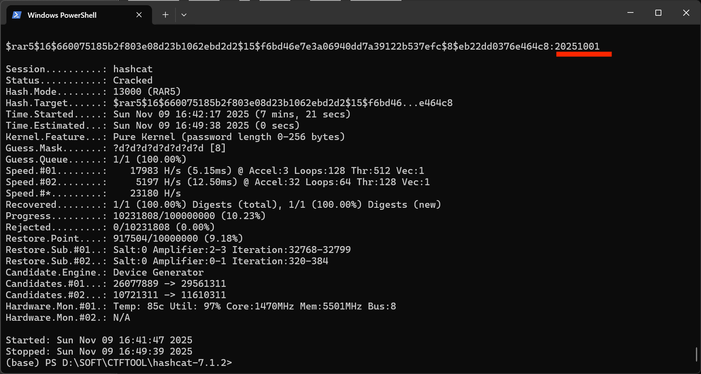

得到密码 `20251001`，解压后获得第二部分二维码：


第三部分被放在一个zip压缩包里，尝试之后可以发现它是伪加密，将标志位修改回 `00 00` 即可打开得到第三部分二维码

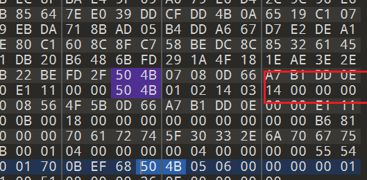


获得四部分二位码后将其拼接得到以下二维码，但是发现并不能扫出来


仔细观察后可以发现其校正图形和格式信息条有缺失，尝试补齐


补齐之后发现也无法扫描


可以注意到缺失的格式条和矫正块的上半部分存在重合，考虑到之前缺失的格式条是全白的，那么有没有可能是把格式条中所有黑色块的所对应的行都通过反色消除掉了呢？

画图尝试

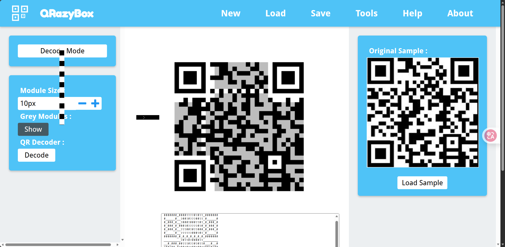

扫描即可得到flag

### Flag

```
flag{R3Ver5e_P014r17y}
```

# Crypto

## 哈基米喔

[哈基米喔.txt](哈基米喔.txt)

打开附件发现是一串哈基米神秘语言

这种自定义的加密方式，盲猜能在网上找到

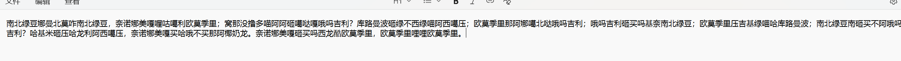

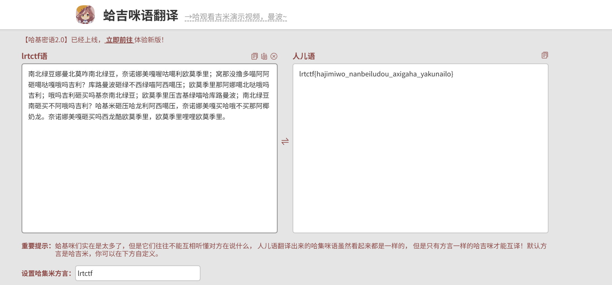

直接解密得到乱码，猜测存在哈基米方言（key），小小猜测以下即可解出

### Flag

```
lrtctf{hajimiwo_nanbeiludou_axigaha_yakunailo}
```

## 这里有一串神秘代码

[crypto.txt](crypto.txt)

打开附件得到密文如下


可以发现其保持flag基本格式，猜测为凯撒加密

flag头为4位，那么flag头就是 `flag{`

则其偏移为

| 密文 | 明文 | 偏移 |
| ---- | ---- | ---- |
| p    | f    | 10   |
| w    | l    | 11   |
| n    | a    | 13   |
| w    | g    | 16   |

依次类推，完整的偏移序列即为

```
10,11,13,16,20,25,5,12,20,3,13,24,10,23,11...
```

写脚本解密即可

```python
cipher = "pwnw{vti_bbs_xce_zn_etdrr}"
def generate_s(n):
    s = [10, 11, 13, 16]
    d = [1, 2, 3]
    for i in range(4, n):
        next_d = d[-1] + 1
        d.append(next_d)
        next_shift = (s[-1] + next_d) % 26
        s.append(next_shift)
    return s[:n]
def decrypt(cipher):
    result = []
    s = generate_s(len(cipher))
    for i, ch in enumerate(cipher):
        if 'a' <= ch <= 'z':
            shift = s[i]
            dec = chr((ord(ch) - ord('a') - shift) % 26 + ord('a'))
            result.append(dec)
        else:
            result.append(ch)
    return ''.join(result)

plaintext = decrypt(cipher)
print(plaintext)

```

### Flag

```
flag{wow_you_are_so_smart}
```

# Reverse

## 分成三份的旗

[Reverse Hidden Sections.exe](Reverse%20Hidden%20Sections.exe)

拖附件入IDA,在主函数中可以找到装真正逻辑的 `state_machine` 函数

从未去除的符号中可以看到 `xored`，`keys`等变量，以及明文存储的几部分flag

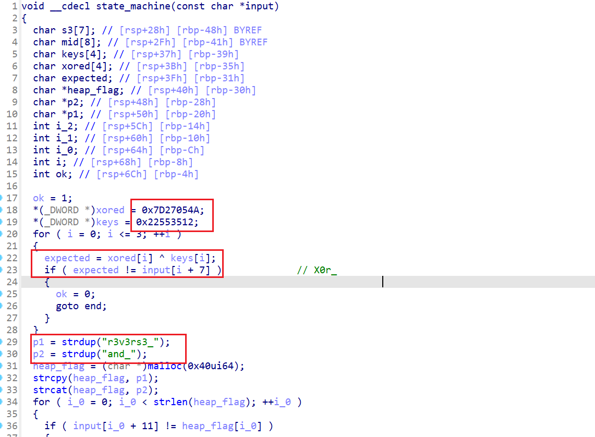

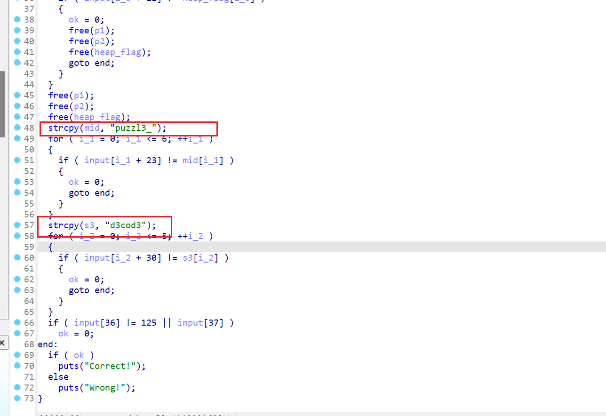

补上flag头`lrtctf{}`后即可

### Flag

```
lrtctf{X0r_r3v3s3_and_puzzl3_d3cod3}
```

## 安卓

[app-release.apk](app-release.apk)

在assets找到 `payload.enc`，base64编码


解码后得到**fake_flag**

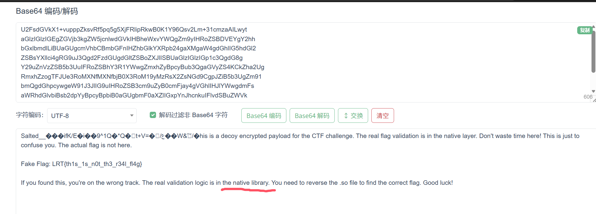

回到MainActivity，发现java层没有什么分析价值，所有关键逻辑均在Native层中

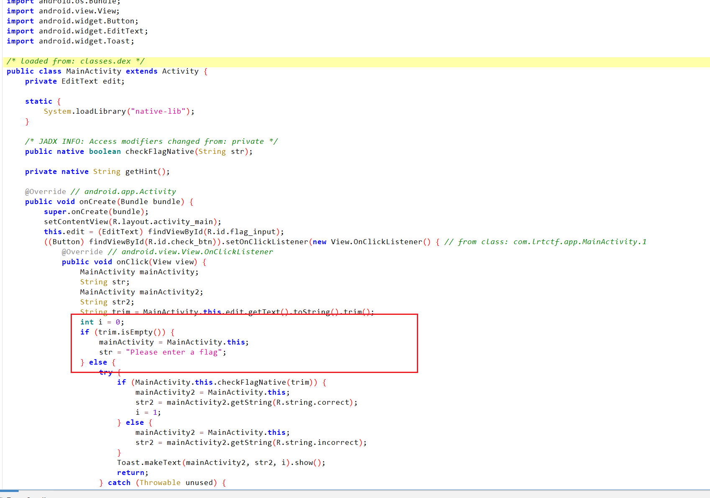

解包apk，对libnative-lib.so进行分析

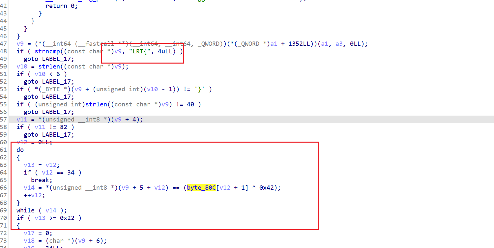

可以找到flag头，下方存在一个异或加密

一眼flag

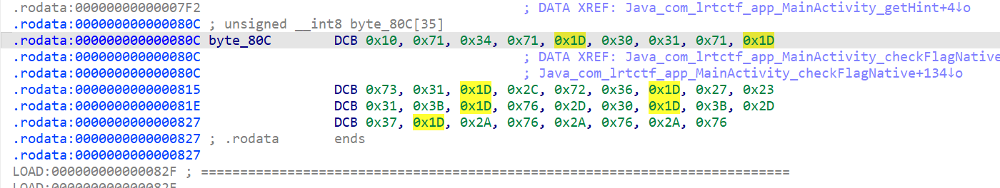

解密即可

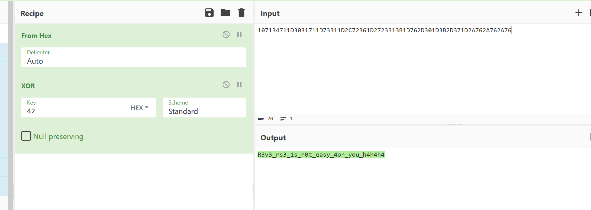

### Flag

```
LRT{R3v3_rs3_1s_n0t_easy_4or_you_h4h4h4}
```

## 迷宫里面有什么

[maze.zip](maze.zip)

在main函数中找到入口


分析后发现在输入为“a”或“d”时，其中一个变量会被检测是否等于14，“w”和“s”同理，可以判断其分别对应X坐标和Y坐标，且迷宫索引不大于14，即迷宫是15*15的

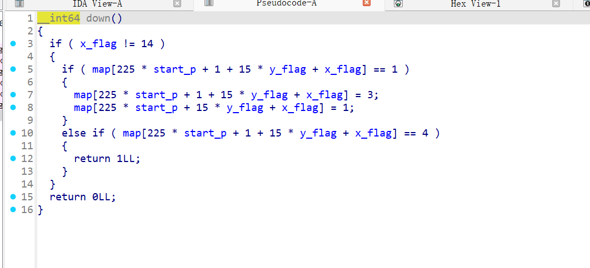

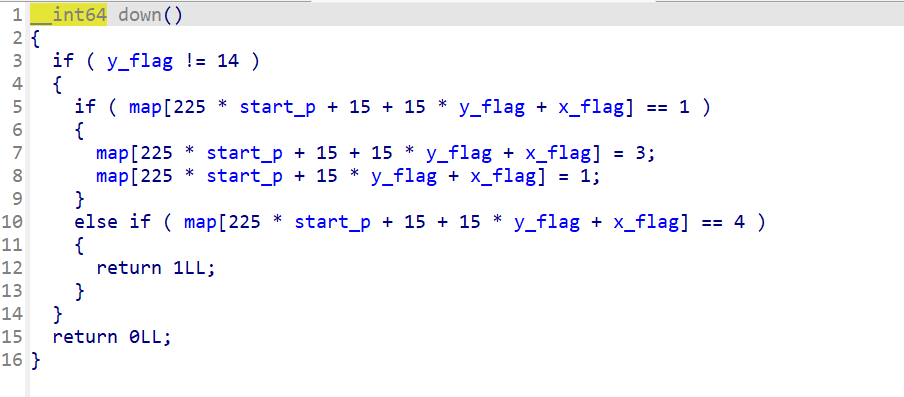

此外，可以看到当迷宫元素==4的时候函数返回1，可以判断“4”是迷宫的终点

图中的大数组即为迷宫数组

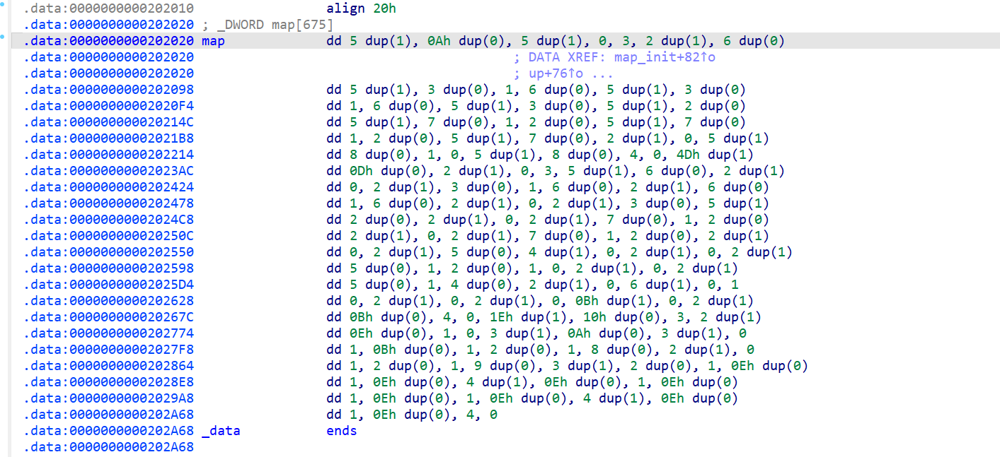

提取后得到如下迷宫

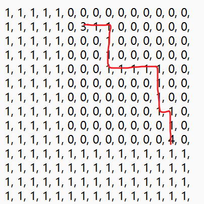

```
ddsssddddsssdss
```


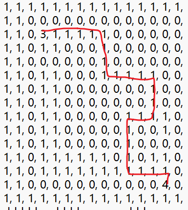

```
dddddsssddddsssaassssddds
```


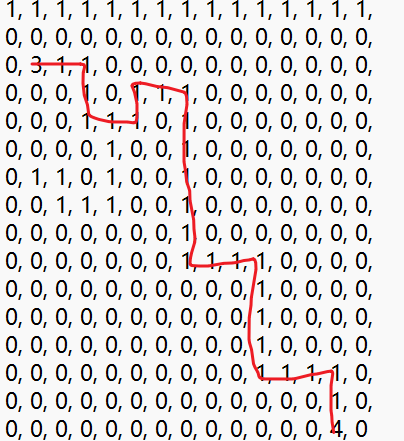

```
ddssddwddssssssdddssssdddss
```

拼接算md5即可得到flag

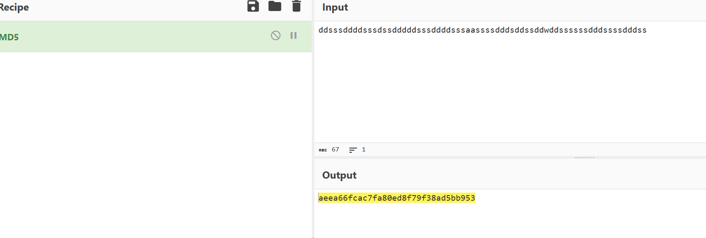

### Flag

```
aeea66fcac7fa80ed8f79f38ad5bb953
```

