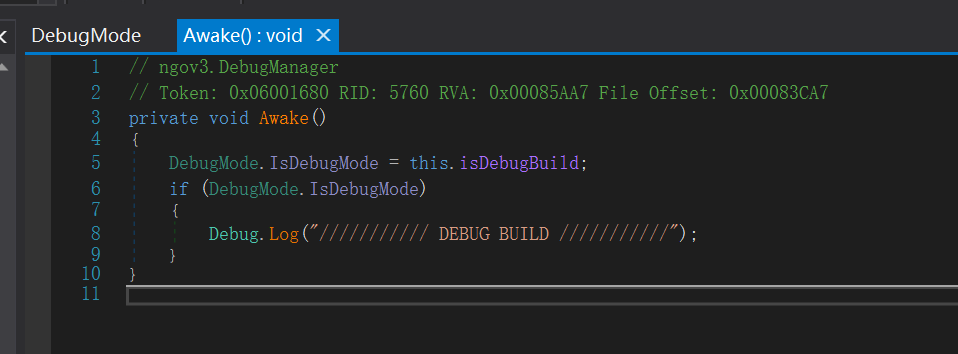

众所周知，《主播女孩重度依赖》是一款用Unity开发的游戏，而开发者发布的游戏程序未使用 `il2cpp`封装，因此可以很容易反编译 `Assembly-CSharp.dll`的 C# 代码，而在其中也暗藏着内部调试模式。

*~~三年前就发现的东西，虽然没什么意义了，但我就是要水~~*

# 启用调试模式

在 `ngov3.DebugManager.Awake()`中，可发现对 `DebugMode`类中 `IsDebugMode`的引用，当游戏构建为Debug构建时，该值为 `true`。

右键编辑类，将该处直接替换为 `true`，回编译后打开游戏，即可启用调试模式。

# 使用

游戏画面右上角可见小蓝色爱心图标，点击即可进入调试界面。

调试界面为游戏的第一天晚上，桌面包含了所有在游戏过程中可能出现的txt文件，一个“任务管理器”图标，和一个选择需要测试的事件的下拉菜单。

“任务管理器”可以设置糖糖的各项数值，也可以设置游戏天数(Day)，涩涩次数(sxx Counter)，各类别直播的等级(netaLevel)。

在下拉菜单中可选择各种事件和功能，包括测试事件、游戏加速、游戏结局等。

## 一些事件的结果

### Event_ImageTest

会出现此推文。

### Test_ShowAllJine

出现糖糖的JINE疯狂轰炸，且无法选择选项。

### Ending_KowaiInternet

此分类下所有事件均为“堕落线”不同天数的对应事件。

---