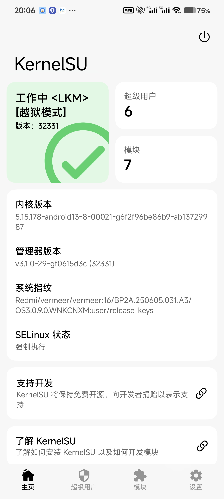
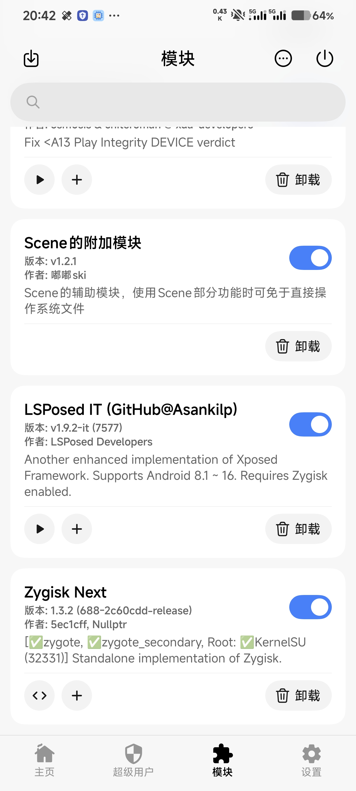
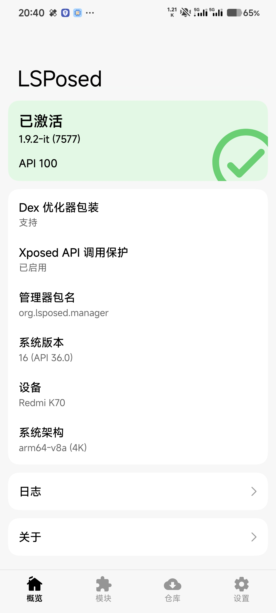

# 🚨**免责声明 | Disclaimer**🚨

- 本文仅对已公开披露的历史漏洞进行整理说明，目的在于安全研究与教育。依据本文操作所产生的一切后果（含数据丢失、设备损坏等）须由读者**自行承担**，作者不提供任何明示或暗示的保证。
- This article documents previously disclosed vulnerabilities solely for security research and educational purposes. You **assume full responsibility for any outcomes** (including data loss or device damage) that arise from attempting the described root procedure; the author offers no warranty of any kind.

:::warning
此文章尚不完善，可能存在错误，请谨慎操作。
:::

[上一篇文章](../xiaomi-root-privilege-escalation-exploit-with-shizuku/)中说明了利用小米设备的漏洞将 root 权限授予 Shizuku 的方法，近期 [KernelSU](https://kernelsu.org/) 对未解锁 bl 而获取 root 权限的“越狱”提供了官方支持，本文章将说明如何在这种设备上使用 KernelSU。

# 笔者的环境
- 设备： Redmi K70
- HyperOS 版本： 3.0.9.0.WNKCNXM
- Android 安全更新： 2026-02-01
- KernelSU 内核版本： 32331

:::warning
不保证所有机型，所有系统版本均适用此方法。
:::

# 设置 SELinux 宽容模式

按照上一篇文章所述，将 SELinux 设置为宽容模式。

# 激活 KernelSU 
首先获取内核版本 32331 及以上的 `ksud` 二进制程序及对应的 `manager.apk`。  
可以在[此处](https://github.com/tiann/KernelSU/actions/runs/22937727662)下载 32331 版本的构建。

在手机上安装 `manager.apk`，将 `ksud` 发送到手机并授予可执行权限：
```shell
adb push ksud /data/local/tmp
adb shell chmod a+x /data/local/tmp/ksud
```
使用 root 权限执行 late-load：
```shell
adb shell service call miui.mqsas.IMQSNative 21 i32 1 s16 "/data/local/tmp/ksud" i32 1 s16 "late-load" s16 '/sdcard/log.txt' i32 600
```

KernelSU 已经激活。
# 将 SELinux 重新设为严格模式
:::note
较新的 KernelSU 构建可以自动完成此操作。
:::
在 KernelSU 管理器给 `com.android.shell` 挂载 `su`，并在 ADB Shell 执行：
```shell
su -c setenforce 1
```
可将 SELinux 重新设为严格模式。
:::important
每一次重启设备都需要执行上述步骤来恢复 KernelSU 环境。
:::

# 安装模块
:::caution
KernelSU 拥有极高的权限，安装危险模块（如直接操作 `/system` 等分区的模块）以及恶意模块很可能会使设备**变砖**。

**安装模块应三思而后行！！安装危险模块极有可能变砖，且在未解锁 bl 的情况下极难救砖！！**  

**安装模块应三思而后行！！安装危险模块极有可能变砖，且在未解锁 bl 的情况下极难救砖！！**  

**安装模块应三思而后行！！安装危险模块极有可能变砖，且在未解锁 bl 的情况下极难救砖！！**  
:::
可以在模块仓库或通过 zip 文件安装模块。安装、启用/禁用、卸载模块等需要“重启生效”的操作，一般可通过执行 `ksud late-load` 来立即生效。若不生效，则可能需要硬重启设备。

## 安装 LSPosed
在 KernelSU 安装 Zygisk Next 及 LSPosed IT，并使用 `ksud late-load` 或硬重启设备生效。  
若 LSPosed 管理器仍提示“未安装”，则需要以下仓库里的 `fix_lspd.sh` 来修复。
::github{repo="xunchahaha/mi_nobl_root"}
以 root 权限运行该脚本，会使 `zygote64` 被杀死， **所有运行中的应用会被关闭。** 若修复完成，LSPosed 应该可以使用。


:::important
每一次重启设备都需要执行上述步骤来恢复 Zygisk + LSPosed 环境。
:::